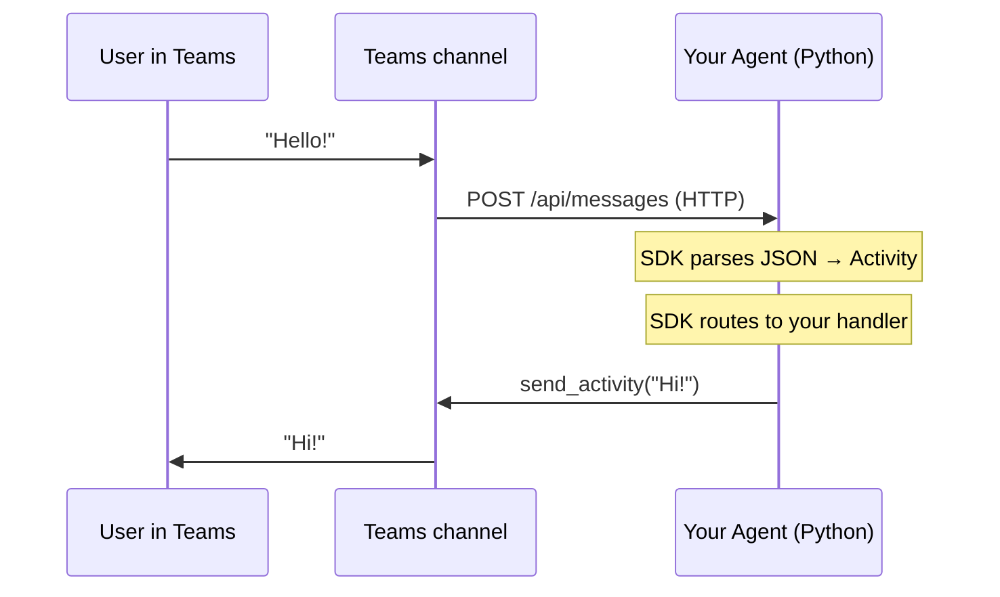

# 🐣 Phase 0 — Setup & First Look at the SDK

> **Goal**: After this phase you'll have a working Python environment, the SDK installed, and you'll know **what an agent actually is** before writing one.

**Duration**: ~30–45 minutes.

---

## 📚 What you'll learn

1. What **the SDK actually does** (3 jobs).
2. The difference between the **two SDKs** that share the "Agent 365" name.
3. How to install Python, the SDK, and verify everything works.
4. How to read a SDK error message without panic.

---

## 1️⃣ What is an "agent"? (kid version)

Imagine a tiny robot at a coffee counter.

- 👂 A customer says "I want a latte."
- 🧠 The robot thinks "ok, latte costs $4, I should make one."
- 🤖 The robot says "That'll be $4, please."

An **agent** is just that robot, but it lives inside a chat. The "counter" is Microsoft Teams (or a website, or Outlook). The "thinking" is your Python code (often helped by an AI model).

The SDK gives the robot:

1. **Ears** — receives messages from any chat surface.
2. **A brain wiring panel** — lets you decide what to do with each message.
3. **A mouth** — sends a reply back to the right person on the right channel.

That's it. The SDK does **not** decide what the robot *says* — that's your code.

---

## 2️⃣ The two SDKs (must read!)

Microsoft uses two names that look almost identical:

| Name | What it does | When you use it |
|---|---|---|
| **Microsoft 365 Agents SDK** | Build the agent (ears, mouth, routing, state). | Phase 1–7 |
| **Microsoft Agent 365 SDK** | Make the agent enterprise-safe (identity, audit, governed M365 data access). | Phase 8+ |

> 👶 Think: **365 Agents** = the toy car. **Agent 365** = the seatbelt, license plate, and registration that makes it street-legal.

In Python, the foundation SDK packages start with `microsoft-agents-hosting-…` and `microsoft-agents-activity`. The enterprise packages all start with `microsoft-agents-a365-…`.

---

## 3️⃣ The 3 jobs of the SDK (precisely)

When a message arrives at your agent, the SDK:

1. **Receives** the raw HTTP request from a channel and turns it into a Python `Activity` object.
2. **Routes** the activity to the right handler in your code (e.g. `@AGENT_APP.message("/help")`).
3. **Sends** your reply back through the same channel, in that channel's format.



---

## 4️⃣ Walkthrough: install everything

> If you already completed [SETUP.md](../SETUP.md), you can skim this. Otherwise, do every step.

### Step 1 — Verify Python

```powershell
python --version
```

You need `Python 3.10.x` or `Python 3.11.x`.

> If you see `Python was not found` (Windows), reinstall Python from python.org and tick "Add Python to PATH".

### Step 2 — Create and activate a venv

From inside `Agent365_SDK_Learning/`:

```powershell
python -m venv .venv
.\.venv\Scripts\Activate.ps1
```

Your prompt should now begin with `(.venv)`.

### Step 3 — Install the SDK

```powershell
pip install --upgrade pip
pip install -r requirements.txt
```

This installs **all** packages you'll need for Phase 1–7. (Phase 8 adds a few more — we'll install them then.)

### Step 4 — Smoke test

Make a file `phase0_smoke.py` here (in `Phase0_Setup/`):

```python
"""Phase 0 smoke test — proves the SDK is installed."""

from microsoft_agents.hosting.core import (
    AgentApplication,
    TurnContext,
    TurnState,
    MemoryStorage,
)
from microsoft_agents.hosting.aiohttp import CloudAdapter
from microsoft_agents.activity import Activity, ActivityTypes

print("✅ Imports succeeded")
print(" - AgentApplication:", AgentApplication)
print(" - TurnContext:     ", TurnContext)
print(" - TurnState:       ", TurnState)
print(" - MemoryStorage:   ", MemoryStorage)
print(" - CloudAdapter:    ", CloudAdapter)
print(" - Activity:        ", Activity)
print(" - ActivityTypes:   ", ActivityTypes)
```

Run it:

```powershell
python Phase0_Setup\phase0_smoke.py
```

If you see seven ✅ lines, you're golden. Move on. If you see `ModuleNotFoundError`, your venv is probably not active — repeat Step 2.

### Step 5 — Look at the installed packages

```powershell
pip list | findstr microsoft-agents
```

You'll see something like:

```
microsoft-agents-activity         1.0.0
microsoft-agents-authentication-msal 1.0.0
microsoft-agents-hosting-aiohttp  1.0.0
microsoft-agents-hosting-core     1.0.0
microsoft-agents-hosting-teams    1.0.0
microsoft-agents-storage-blob     1.0.0
microsoft-agents-storage-cosmos   1.0.0
```

Each of those is a **separate** PyPI package, and we'll learn what each does over the next few phases.

---

## 5️⃣ Read an error message without panic

Try this — it will fail on purpose:

```python
from microsoft_agents.hosting.core import ThisClassDoesNotExist
```

You'll see something like:

```
ImportError: cannot import name 'ThisClassDoesNotExist' from 'microsoft_agents.hosting.core'
```

**Rule**: Always read the **last line** of an error first. It usually tells you the exact problem.

Other common errors and what they really mean:

| Error you see | Real meaning | Fix |
|---|---|---|
| `ModuleNotFoundError: No module named 'microsoft_agents'` | venv not active, or `pip install` not done | `.\.venv\Scripts\Activate.ps1` then `pip install -r requirements.txt` |
| `aiohttp.client_exceptions.ClientConnectorError` | The agent is not running, or the port is wrong | Start the agent first; check port 3978 |
| `KeyError: 'CLIENTID'` | Missing env var | Copy `.env.example` to `.env` |
| `401 Unauthorized` | Authentication mismatch | For local testing set `CONNECTIONS__SERVICE_CONNECTION__SETTINGS__ANONYMOUS_ALLOWED=True` |

---

## 6️⃣ The mental model going forward

For the next few phases, hold this picture in your head:

```
+-------------------------------------------------------------+
|                       AgentApplication                       |
|   (the thing you create once in app.py)                      |
|                                                              |
|   ┌──────────────────────────────────────────────────────┐   |
|   │ Handlers you register                                │   |
|   │   @app.message("/help")        → on_help             │   |
|   │   @app.activity("message")     → on_any_message      │   |
|   │   @app.conversation_update(…)  → on_member_joined    │   |
|   └──────────────────────────────────────────────────────┘   |
|                          ▲                                   |
|                          │ Activity                          |
|                          │                                   |
|   ┌──────────────────────────────────────────────────────┐   |
|   │ CloudAdapter — talks HTTP to the channels            │   |
|   └──────────────────────────────────────────────────────┘   |
+-------------------------------------------------------------+
```

You build the brain in `app.py`. The CloudAdapter is the glue you almost never touch.

---

## ✅ Phase 0 checklist

- [ ] Python 3.10 or 3.11 installed.
- [ ] `Agent365_SDK_Learning/.venv` exists and is activated.
- [ ] `pip install -r requirements.txt` ran with no errors.
- [ ] `phase0_smoke.py` prints seven ✅ lines.
- [ ] You can name the **two SDKs** and what each does.
- [ ] You completed [exercises.md](exercises.md).

Next → [Phase 1 — Foundations](../Phase1_Foundations/README.md)
