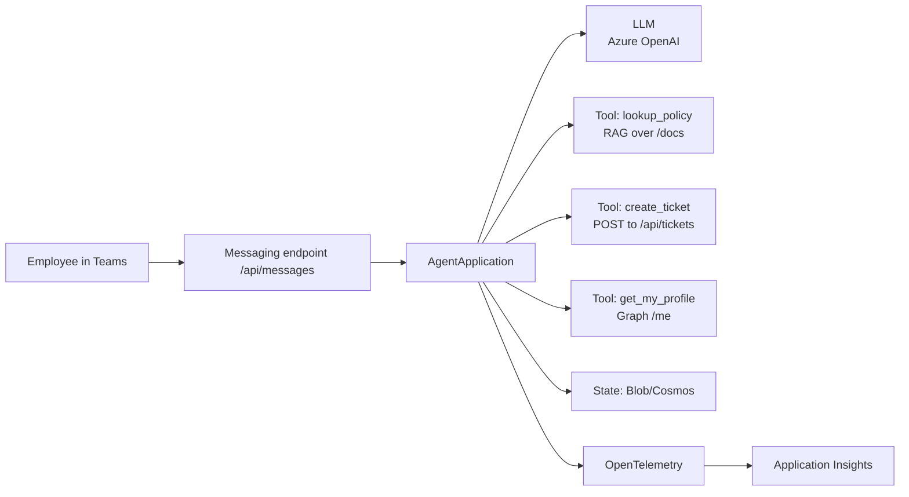

# 🎓 Phase 10 — Capstone: Contoso IT Companion

> **Goal**: Combine everything from Phases 1–9 into one end-to-end agent and prove you can build, govern, and ship it.

**Duration**: 1–2 days (your pace).
**Scenario**: **Contoso IT Companion** — a Teams agent that helps employees with IT questions, raises and tracks tickets, leverages company policy docs (RAG), supports SSO, sends governed notifications, and is fully observable.

---

## 📋 Requirements

The capstone must demonstrate **at least one capability from each phase**:

| Phase | Capability you must show |
|---|---|
| 1 | A working `AgentApplication` with `/api/messages`. |
| 2 | At least three handler types (`activity`, `message`, `conversation_update`, or regex). |
| 3 | Persisted state (Blob or Cosmos preferred; Memory OK for the demo). |
| 4 | At least two Adaptive Cards (a form + a confirmation). |
| 5 | LLM-backed conversational replies with system prompt and history. |
| 6 | At least three tools, including one that performs RAG over `docs/`. |
| 7 | OAuth/SSO login and one Graph call (e.g. `/me` or calendar). |
| 8 | Agent 365 identity OR governed MCP OR OTel — at minimum the OTel wiring. |
| 9 | A pytest suite + Dockerfile + one-command deploy script. |

---

## 🧱 Suggested architecture



---

## 🗂️ Suggested project layout

```
contoso_it_companion/
├── app.py                  # Agent wiring (handlers)
├── start_server.py
├── llm.py                  # Azure OpenAI client + chat-with-tools loop
├── rag.py                  # In-memory or Azure AI Search RAG
├── tools.py                # lookup_policy / create_ticket / get_my_profile
├── cards/
│   ├── ticket_form.py
│   └── ticket_confirm.py
├── docs/                   # company policy markdown
│   ├── password_policy.md
│   ├── vpn.md
│   └── ...
├── tests/
│   ├── test_handlers.py
│   └── test_tools.py
├── deploy/
│   ├── Dockerfile
│   ├── main.bicep
│   └── azure.yaml
├── teams_manifest/
│   ├── manifest.json
│   ├── color.png
│   └── outline.png
├── requirements.txt
└── .env.example
```

A starter skeleton lives at [`code/contoso_it_companion/`](code/contoso_it_companion/). Fill in the TODOs.

---

## 🛠️ Step-by-step build plan

### Day 1 — Build

1. **Scaffold** — copy Phase 6 RAG agent into `contoso_it_companion/`. Rename and verify it runs.
2. **Add tools** — `create_ticket(title, severity, body)` (mock REST POST), `get_my_profile()` (Graph), keep `lookup_policy`.
3. **Adaptive Cards** — `cards/ticket_form.py` (title/severity/body) and `cards/ticket_confirm.py`. Wire to a `request ticket` command.
4. **SSO** — bring in MSAL from Phase 7. Make `get_my_profile` use the user's token.
5. **State** — swap `MemoryStorage` for `BlobStorage` (Azurite locally; real account in Azure).
6. **Observability** — add `configure_otel(...)` from Phase 8.

### Day 2 — Test & Ship

7. **Tests** — 6+ pytest cases covering: card render, tool dispatch, regex routing, state persistence, OAuth-guarded handler returns helpful message when not signed in, error handling for LLM failures.
8. **Local dry-run** — Emulator + dev tunnel + side-load into Teams.
9. **Deploy** — `azd up`. Update Bot resource Messaging endpoint. Verify in Teams.
10. **Demo run** — record yourself running the demo script below.

---

## 🎬 Demo script

Run these in order in Teams:

1. `help` → menu of capabilities.
2. `login` → sign in card → success.
3. `who am I?` → calls `get_my_profile` → "You are <Display Name> (<email>)".
4. "What is the password policy?" → triggers `lookup_policy`, quotes a doc.
5. "Raise a ticket" → ticket form Adaptive Card.
6. Submit the form → confirmation card with `TKT-…`.
7. "Show my recent tickets" → list (from in-memory store).
8. Open App Insights → Application Map → show the full span of step 4 (handler → LLM → tool → reply).

---

## ✅ Acceptance checklist

- [ ] Every capability in the requirements table demonstrated.
- [ ] Tests pass: `pytest -q`.
- [ ] `docker build` succeeds.
- [ ] `azd up` succeeds and the agent responds in Teams.
- [ ] App Insights shows traces for at least one full conversation.
- [ ] No secrets in code or `.env` files committed to git.
- [ ] README in the project root explains how to run it.

---

## 🚀 Stretch goals

If you finish early, pick any:

- **Proactive notifications**: every Monday DM each user with their open tickets count.
- **Multi-language**: detect user language (Phase 3 user-scope state) and translate replies.
- **Vector store upgrade**: swap in-memory RAG for **Azure AI Search** with hybrid search.
- **Function-calling streaming**: stream the LLM reply while tools execute.
- **Approval workflow**: high-severity tickets require manager approval via an Adaptive Card.
- **GitHub Actions**: CI that runs `pytest`, then deploys on `main`.

---

## 🎓 Graduation

When the acceptance checklist is fully ticked, you have built a production-shape Agent 365 SDK solution end-to-end. You can now:

- Build any conversational + LLM + RAG + auth agent on the Microsoft 365 Agents SDK.
- Wrap it in the Agent 365 enterprise layer.
- Test, observe and deploy it in Azure.

Congratulations 🎉 — go ship something useful.

---

## 📚 Where to go next

- **Microsoft Learn** — official docs for both SDKs.
- **MCP spec** — <https://modelcontextprotocol.io/>
- **Adaptive Cards designer** — <https://adaptivecards.io/designer/>
- **Bot Framework Composer** — visual builder for advanced dialog flows.
- **Semantic Kernel** — alternative orchestrator for multi-agent / planning.
