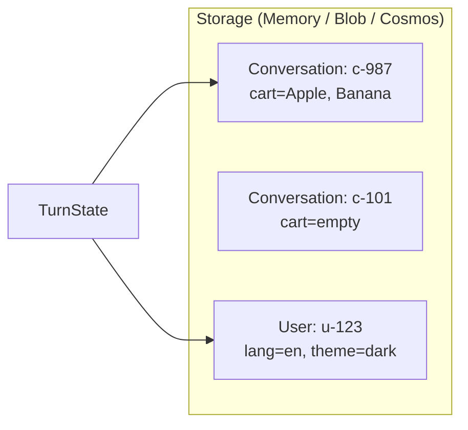

# 🛒 Phase 3 — State & Storage

> **Goal**: Make your agent *remember*. Build a **Shopping-Cart Agent** that survives multiple turns.

**Duration**: ~75 minutes.

---

## 📚 What you'll learn

1. Why agents are stateless by default and why that's a problem.
2. The three state scopes: `conversation`, `user`, `temp`.
3. Using `MemoryStorage` for dev and `BlobStorage` / `CosmosDb` for prod.
4. The save-after-modify rule.

---

## 1️⃣ Why state?

Each call to your handler is a **fresh function call**. Local variables die when the function returns. If you want the agent to remember anything (a name, a cart, the last topic), you need to put that data in **state**.

The SDK gives you three scopes:

| Scope | Lives for | Use for |
|---|---|---|
| `state.conversation` | One conversation (a chat thread) | Shopping cart, last question, current step |
| `state.user` | One user, across all their conversations | Display name, language preference |
| `state.temp` | One turn only | Calculated values you don't want to recompute |



The SDK **auto-loads** state at the start of each turn and **saves** it at the end if your code marks it dirty.

---

## 2️⃣ Setting up state

```python
from microsoft_agents.hosting.core import (
    AgentApplication,
    MemoryStorage,
    TurnContext,
    TurnState,
)

# 1. Pick a storage backend
storage = MemoryStorage()

# 2. Create the AgentApplication with that storage
AGENT_APP = AgentApplication(storage=storage)

# 3. Read/write in handlers:
@AGENT_APP.message("cart")
async def show_cart(context: TurnContext, state: TurnState):
    # state.conversation is a dict-like object scoped to this conversation
    cart = state.conversation.get("cart", [])
    await context.send_activity(f"Your cart: {cart or 'empty'}")
```

That's it — `state.conversation` is a plain dict. Write to it like any dict; the SDK persists at end of turn.

---

## 3️⃣ Save-after-modify (important!)

`MemoryStorage` is forgiving — it saves on every turn. **Persistent** backends (Blob, Cosmos) only save when you tell them to.

For safety, get into the habit:

```python
state.conversation["cart"] = cart
await state.save(context)            # explicit save = always safe
```

`AgentApplication` will call `save` for you automatically on a clean turn — but if your handler `raises`, your changes may be lost. Always wrap risky logic in `try/except`.

---

## 4️⃣ The Shopping-Cart Agent

**Scenario**: A small grocery agent. You can:

- `add <item>` → put item in cart
- `remove <item>` → take out
- `cart` → show contents
- `clear` → empty
- `total` → fake total (count × $1)
- `lang en|de|fr` → set your **personal** language preference (user scope)
- `hi` → greeted in your chosen language

[`code/shopping_cart_agent/app.py`](code/shopping_cart_agent/app.py)

```python
"""Shopping-Cart Agent — Phase 3 example.
Demonstrates conversation-scoped and user-scoped state.
"""
from __future__ import annotations
import re, logging

from microsoft_agents.hosting.core import (
    AgentApplication, MemoryStorage, TurnContext, TurnState,
)
from start_server import start_server

logging.basicConfig(level=logging.INFO)
log = logging.getLogger("cart")

AGENT_APP = AgentApplication(storage=MemoryStorage())

GREETINGS = {"en": "Hello!", "de": "Hallo!", "fr": "Bonjour!"}


# -- Helpers --
def get_cart(state: TurnState) -> list[str]:
    return state.conversation.get("cart", [])

def set_cart(state: TurnState, cart: list[str]) -> None:
    state.conversation["cart"] = cart

def get_lang(state: TurnState) -> str:
    return state.user.get("lang", "en")

def set_lang(state: TurnState, lang: str) -> None:
    state.user["lang"] = lang


# -- Welcome --
@AGENT_APP.conversation_update("membersAdded")
async def welcome(context: TurnContext, state: TurnState):
    for m in context.activity.members_added or []:
        if m.id != context.activity.recipient.id:
            await context.send_activity(
                "🛒 Cart Agent ready. Commands:\n"
                "- `add <item>` / `remove <item>`\n"
                "- `cart` / `clear` / `total`\n"
                "- `lang en|de|fr` (per-user preference)\n"
                "- `hi` (greeted in your language)"
            )


# -- Add: "add apple" --
@AGENT_APP.message(re.compile(r"^add\s+(.+)$", re.IGNORECASE))
async def add_item(context: TurnContext, state: TurnState):
    item = re.match(r"^add\s+(.+)$", context.activity.text, re.IGNORECASE).group(1).strip()
    cart = get_cart(state)
    cart.append(item)
    set_cart(state, cart)
    await context.send_activity(f"✅ Added *{item}*. Cart now has {len(cart)} item(s).")


# -- Remove: "remove banana" --
@AGENT_APP.message(re.compile(r"^remove\s+(.+)$", re.IGNORECASE))
async def remove_item(context: TurnContext, state: TurnState):
    item = re.match(r"^remove\s+(.+)$", context.activity.text, re.IGNORECASE).group(1).strip()
    cart = get_cart(state)
    if item in cart:
        cart.remove(item)
        set_cart(state, cart)
        await context.send_activity(f"🗑️ Removed *{item}*.")
    else:
        await context.send_activity(f"🤔 *{item}* is not in your cart.")


# -- Cart --
@AGENT_APP.message("cart")
async def show_cart(context: TurnContext, state: TurnState):
    cart = get_cart(state)
    if not cart:
        await context.send_activity("Your cart is empty.")
    else:
        bullets = "\n".join(f"- {x}" for x in cart)
        await context.send_activity(f"🛒 Your cart:\n{bullets}")


# -- Clear --
@AGENT_APP.message("clear")
async def clear_cart(context: TurnContext, state: TurnState):
    set_cart(state, [])
    await context.send_activity("🧹 Cart cleared.")


# -- Total --
@AGENT_APP.message("total")
async def total(context: TurnContext, state: TurnState):
    n = len(get_cart(state))
    await context.send_activity(f"💰 Total: ${n}.00 ({n} item(s) × $1)")


# -- Set language (USER scope) --
@AGENT_APP.message(re.compile(r"^lang\s+(en|de|fr)$", re.IGNORECASE))
async def set_language(context: TurnContext, state: TurnState):
    lang = re.match(r"^lang\s+(\w+)$", context.activity.text, re.IGNORECASE).group(1).lower()
    set_lang(state, lang)
    await context.send_activity(f"Language saved to **{lang}** for your profile.")


# -- Greet in chosen language --
@AGENT_APP.message(["hi", "hello", "hey"])
async def greet(context: TurnContext, state: TurnState):
    lang = get_lang(state)
    await context.send_activity(GREETINGS.get(lang, GREETINGS["en"]))


# -- Catch-all --
@AGENT_APP.activity("message")
async def default(context: TurnContext, _state: TurnState):
    await context.send_activity("Try: `add bread`, `cart`, `clear`, `total`, `lang de`, `hi`.")


if __name__ == "__main__":
    start_server(AGENT_APP, None)
```

### Try it

```powershell
cd Phase3_State_and_Storage\code\shopping_cart_agent
python app.py
```

In the test terminal, POST these messages **using the same `conversation.id`** so state persists:

1. `add apple`
2. `add banana`
3. `cart` → returns both
4. `lang de`
5. `hi` → returns "Hallo!"
6. **Restart `app.py`** → `cart` is empty again (MemoryStorage is wiped on restart).

---

## 5️⃣ Persistent storage (Azure Blob / Cosmos DB)

When you ship to production, `MemoryStorage` is unacceptable because:

- Every restart loses everything.
- If you run 3 replicas, they each have **different** memories.

Swap to a persistent backend:

```python
# pip install microsoft-agents-storage-blob
from microsoft_agents.storage.blob import BlobStorage
storage = BlobStorage(connection_string=os.environ["AZURE_STORAGE_CONN"],
                      container_name="agent-state")

AGENT_APP = AgentApplication(storage=storage)
```

```python
# pip install microsoft-agents-storage-cosmos
from microsoft_agents.storage.cosmos import CosmosDbPartitionedStorage
storage = CosmosDbPartitionedStorage(
    cosmos_db_endpoint=os.environ["COSMOS_ENDPOINT"],
    auth_key=os.environ["COSMOS_KEY"],
    database_id="agentdb",
    container_id="state",
)
```

That's literally the **only** code change. Your handlers don't know or care.

---

## 6️⃣ The `temp` scope

Use `state.temp` for data you compute once per turn and want to share between handlers:

```python
@AGENT_APP.before_turn
async def enrich(context, state):
    state.temp["user_name"] = context.activity.from_property.name or "friend"

@AGENT_APP.message("hi")
async def hi(context, state):
    await context.send_activity(f"Hi {state.temp['user_name']}!")
```

`state.temp` is **never** persisted.

---

## 7️⃣ Custom state classes

For more structured state (with type hints), subclass `TurnState`:

```python
from microsoft_agents.hosting.core import TurnState

class CartState(TurnState):
    pass  # add typed properties here later

# Wire it up:
AGENT_APP = AgentApplication[CartState](storage=MemoryStorage(), state_class=CartState)
```

This is the bridge to the more advanced patterns in Phase 5 onward.

---

## ✅ Phase 3 checklist

- [ ] You can name the three scopes and what each is for.
- [ ] Your Shopping-Cart Agent remembers items across turns.
- [ ] User scope (`lang`) survives across conversations.
- [ ] You understand why `MemoryStorage` is dev-only.
- [ ] You completed [exercises.md](exercises.md).

Next → [Phase 4 — Adaptive Cards](../Phase4_Rich_Messaging/README.md)
