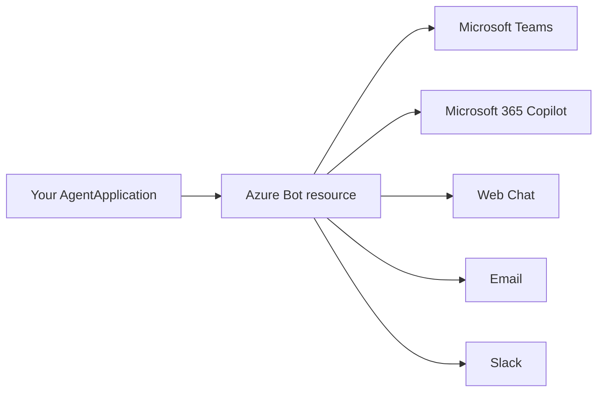
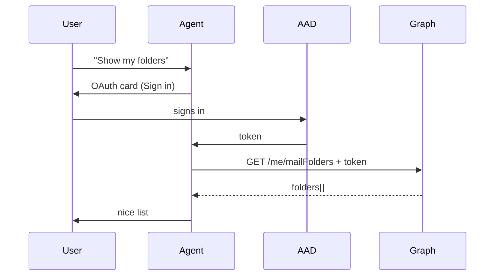

# 🌐 Phase 7 — Multi-channel, Teams & Auth

> **Goal**: Understand channels, take your agent into **Microsoft Teams**, and add **OAuth/SSO** so the agent knows *who* the user is.

**Duration**: ~120 minutes.
**Scenario**: A **Profile Agent** that greets you by your real name, lists your Outlook mailbox folders, and works in both Web Chat and Teams.

---

## 📚 What you'll learn

1. What a **channel** is and how the same agent code reaches many of them.
2. Teams-specific helpers from `microsoft-agents-hosting-teams`.
3. Adding Teams capabilities to your manifest.
4. **OAuth / SSO** with `microsoft-agents-authentication-msal`.
5. How to call Microsoft Graph using the user's token.

---

## 1️⃣ Channels — one agent, many doorways



- **Same code** for all channels.
- The **Azure Bot resource** is the broker that routes activities between channels and your `/api/messages` endpoint.
- Channels add or omit features — e.g. only Teams supports the Compose Extension; only Web Chat allows anonymous users.

You enable channels in the Azure portal under your Bot resource → **Channels** → click the icon.

---

## 2️⃣ Teams specifics

Install the Teams helpers:

```text
microsoft-agents-hosting-teams
```

(already in `requirements.txt`)

This adds:

- `@AGENT_APP.message_extension(...)` — for Teams search-based extensions.
- `@AGENT_APP.task_module(...)` — for modal dialogs.
- Teams-specific activity types (`invoke`, `composeExtension/query`, etc.).
- Helpers to build Teams notifications and proactive messages.

### Teams app manifest

A Teams app needs a **manifest** zip containing:

- `manifest.json` — metadata, scopes, bot id.
- `color.png` (192×192) — app icon.
- `outline.png` (32×32) — outline icon.

Minimal `manifest.json`:

```json
{
  "$schema": "https://developer.microsoft.com/json-schemas/teams/v1.17/MicrosoftTeams.schema.json",
  "manifestVersion": "1.17",
  "version": "1.0.0",
  "id": "REPLACE-WITH-GUID",
  "developer": {
    "name": "Contoso",
    "websiteUrl": "https://contoso.com",
    "privacyUrl": "https://contoso.com/privacy",
    "termsOfUseUrl": "https://contoso.com/terms"
  },
  "name": { "short": "Profile Bot", "full": "Profile Bot" },
  "description": {
    "short": "Greets you and shows your mailbox folders.",
    "full": "Demo bot for Phase 7 of the curriculum."
  },
  "icons": { "color": "color.png", "outline": "outline.png" },
  "accentColor": "#5b53ff",
  "bots": [
    {
      "botId": "REPLACE-WITH-AZURE-BOT-APP-ID",
      "scopes": ["personal", "team", "groupchat"],
      "supportsFiles": false,
      "isNotificationOnly": false
    }
  ],
  "permissions": ["identity", "messageTeamMembers"],
  "validDomains": ["token.botframework.com"]
}
```

A copy lives at [`code/profile_agent/teams_manifest/manifest.json`](code/profile_agent/teams_manifest/manifest.json). Zip the three files and upload via Teams → **Apps → Manage your apps → Upload an app**.

---

## 3️⃣ Authentication primer

There are **two** identities to keep straight:

| Identity | Purpose | Tech |
|---|---|---|
| **Agent identity** | The agent proves it's allowed to talk to the Bot Service. | Bot App Registration (client id/secret or managed identity). |
| **User identity** | The agent acts on behalf of a specific user (e.g. read their mail). | OAuth 2.0 with MSAL — handled by `microsoft-agents-authentication-msal`. |

Today we focus on **user identity / SSO**.

### How user SSO works in an agent



Steps you do once in Azure:

1. Register an app in **Entra ID → App registrations**.
2. Set redirect URI to `https://token.botframework.com/.auth/web/redirect`.
3. Add API permissions: `User.Read`, `Mail.Read` (delegated).
4. In your **Azure Bot** resource → **Configuration → OAuth Connection Settings** → add a connection (e.g. `graph-sso`) with provider **Azure Active Directory v2**, the client id/secret, scopes `User.Read Mail.Read`.

Store the connection name in `.env`:

```dotenv
OAUTH_CONNECTION_NAME=graph-sso
```

---

## 4️⃣ Using auth in code

```python
from microsoft_agents.authentication.msal import MsalAuth

auth = MsalAuth(connection_name=os.environ["OAUTH_CONNECTION_NAME"])
AGENT_APP = AgentApplication(storage=MemoryStorage(), auth=auth)

@AGENT_APP.message("login")
async def login(context, state):
    token = await auth.get_token(context)
    if token:
        await context.send_activity("✅ You're signed in.")
    else:
        await auth.sign_in(context, state)        # sends the OAuth card

@AGENT_APP.message("logout")
async def logout(context, state):
    await auth.sign_out(context, state)
    await context.send_activity("👋 Signed out.")
```

Once signed in, the SDK caches the token. Inside any handler call `await auth.get_token(context)` to get it.

---

## 5️⃣ Calling Microsoft Graph

```python
import httpx

async def list_folders(token: str) -> list[str]:
    async with httpx.AsyncClient(timeout=20) as http:
        r = await http.get(
            "https://graph.microsoft.com/v1.0/me/mailFolders",
            headers={"Authorization": f"Bearer {token}"},
        )
        r.raise_for_status()
        return [f["displayName"] for f in r.json()["value"]]
```

We wire this into the agent so `folders` triggers a Graph call.

---

## 6️⃣ Full agent

[`code/profile_agent/app.py`](code/profile_agent/app.py) puts it together:

- `welcome` — greets new users.
- `login` / `logout` — sign-in flow.
- `me` — calls `/me` and shows `displayName` and `mail`.
- `folders` — lists mailbox folders.
- Default fallback message.

Run locally:

```powershell
cd Phase7_Channels_Teams_Auth\code\profile_agent
Copy-Item .env.example .env
python app.py
```

> 💡 Tip: full SSO requires a public HTTPS endpoint (the OAuth redirect must reach your server). Use **dev tunnels** in VS Code or **ngrok**:
>
> ```powershell
> code tunnel        # or: ngrok http 3978
> ```
>
> Then put the public URL into your Bot resource **Messaging endpoint** as `https://<tunnel>/api/messages`.

---

## 7️⃣ Channel-aware logic

```python
channel = context.activity.channel_id   # "msteams", "webchat", "emulator", ...

if channel == "msteams":
    # Teams-specific: mention the user
    from microsoft_agents.hosting.teams import TeamsActivityHelpers
    await context.send_activity(TeamsActivityHelpers.mention(context, "Hi!"))
else:
    await context.send_activity("Hi!")
```

Branch on `channel_id` only when you must — keep the bulk of code channel-agnostic.

---

## 8️⃣ Gotchas

| Symptom | Cause / fix |
|---|---|
| OAuth card never appears | `OAuth Connection Settings` name doesn't match `OAUTH_CONNECTION_NAME`. |
| Sign-in loop | Redirect URI in Entra ≠ `https://token.botframework.com/.auth/web/redirect`. |
| Graph returns 401 | Token scopes don't match what Graph needs. Re-check connection settings scopes. |
| Works in Web Chat, fails in Teams | App not added to the Teams scope (personal/team/groupchat) in the manifest, or bot id mismatch. |
| Localhost tunnels die | Use VS Code dev tunnels with `--allow-anonymous false`, or a static ngrok subdomain. |

---

## ✅ Phase 7 checklist

- [ ] You created an Azure Bot resource and an OAuth connection.
- [ ] `login` triggers a sign-in card; you can read folders after sign-in.
- [ ] You side-loaded the bot in Teams using the manifest zip.
- [ ] You completed [exercises.md](exercises.md).

Next → [Phase 8 — Agent 365 enterprise layer](../Phase8_Agent365_Enterprise/README.md) — the **other** SDK and why it matters.
