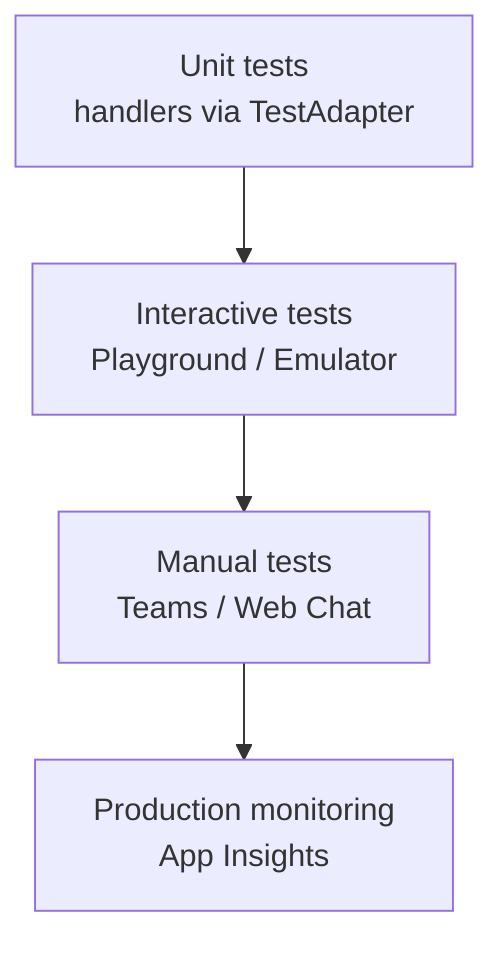

# 🚀 Phase 9 — Testing, Debugging & Deployment

> **Goal**: Move your agent from `python app.py` on your laptop to a real Azure deployment, with confidence — including unit tests, local tunnels, and production monitoring.

**Duration**: ~150 minutes.
**Scenario**: Take the Phase 6 IT Knowledge Agent through the full pipeline: pytest → Emulator → dev tunnel → Container App.

---

## 📚 What you'll learn

1. Unit-test handlers with `TestAdapter`.
2. Test interactively with **Agents Playground** and **Bot Framework Emulator**.
3. Expose local agent over the internet (dev tunnels / ngrok).
4. Containerize with a Dockerfile.
5. Deploy to **Azure Container Apps** with `azd`.
6. Hook up **Application Insights** for logs and metrics.
7. Read traces — what to look for when something breaks.

---

## 1️⃣ Testing pyramid



Move from cheap/fast (unit) to expensive/slow (prod). Each level catches a different class of bug.

---

## 2️⃣ Unit testing with `TestAdapter`

The SDK ships a `TestAdapter` that lets you drive an agent in-process.

[`code/tests/test_echo.py`](code/tests/test_echo.py)

```python
import pytest
from microsoft_agents.hosting.core import (
    AgentApplication, MemoryStorage, TestAdapter, TurnContext, TurnState,
)

@pytest.mark.asyncio
async def test_echo_replies():
    app = AgentApplication(storage=MemoryStorage())

    @app.activity("message")
    async def on_msg(context: TurnContext, state: TurnState):
        await context.send_activity(f"You said: {context.activity.text}")

    adapter = TestAdapter()
    await adapter.process_activity_with_message("hi", app)
    reply = adapter.get_next_reply()
    assert reply.text == "You said: hi"
```

Run:

```powershell
pytest -q
```

### Mocking the LLM

For tools/RAG agents, mock the OpenAI client so tests don't hit the network:

```python
from unittest.mock import AsyncMock, patch

@patch("llm._client")
async def test_buddy(mock_client):
    mock_client.return_value.chat.completions.create = AsyncMock(
        return_value=Mock(choices=[Mock(message=Mock(content="Gravity pulls things down."))])
    )
    # ... drive the agent and assert
```

---

## 3️⃣ Agents Playground (built-in)

The hosting library ships a small local "Playground" UI you can open by pointing your browser at the messaging endpoint. With anonymous-allowed local mode you can just open <http://localhost:3978/api/messages> via the **Microsoft 365 Agents Playground** Visual Studio extension or VS Code feature.

The fastest manual test loop:

```powershell
python app.py
# in another terminal:
Invoke-RestMethod -Uri http://localhost:3978/api/messages -Method POST -ContentType "application/json" -Body (@{ type="message"; text="hi"; from=@{ id="u1" }; recipient=@{ id="bot" }; conversation=@{ id="c1" }; serviceUrl="http://localhost" } | ConvertTo-Json -Depth 5)
```

---

## 4️⃣ Bot Framework Emulator

The **Bot Framework Emulator** (free download) is the classic chat tester:

1. Install from <https://github.com/Microsoft/BotFramework-Emulator/releases>.
2. Start your agent: `python app.py`.
3. In the Emulator: **Open Bot** → URL `http://localhost:3978/api/messages` → leave app id/password blank.
4. Chat — every activity round-trip is shown in JSON in the Inspector pane.

Use the Inspector to diagnose:

- Why didn't a handler fire? Look at `activity.type` and `activity.text`.
- Adaptive Card not rendering? Look at the `attachments[0].content` JSON.

---

## 5️⃣ Public endpoint for SSO / Teams

Bots that talk to Azure Bot Service / Teams need **HTTPS + public reachability**.

### VS Code dev tunnels

```powershell
code tunnel
# follow the device-code login; copy the https URL it shows
```

### ngrok alternative

```powershell
ngrok http 3978
```

Take the public `https://xxx.ngrok-free.app` URL and set it as your **Bot Messaging endpoint** in the Azure Bot resource: `https://xxx/api/messages`.

---

## 6️⃣ Containerize

[`code/deploy/Dockerfile`](code/deploy/Dockerfile)

```dockerfile
FROM python:3.11-slim
ENV PYTHONUNBUFFERED=1 PIP_NO_CACHE_DIR=1
WORKDIR /app
COPY requirements.txt .
RUN pip install -r requirements.txt
COPY . .
EXPOSE 3978
CMD ["python", "app.py"]
```

Build & run locally:

```powershell
docker build -t my-agent:dev .
docker run --rm -p 3978:3978 --env-file .env my-agent:dev
```

---

## 7️⃣ Deploy to Azure Container Apps

The smoothest path: **`azd`** (Azure Developer CLI).

```powershell
# once per machine
winget install Microsoft.AzureDeveloperCLI

# in the project folder
azd init --template minimal       # or write your own bicep
azd up
```

`azd` provisions:

- Resource group
- Container Registry (or uses managed reg)
- Container Apps environment + app
- Log Analytics workspace
- Application Insights resource

After `azd up` finishes, copy the URL (e.g. `https://my-agent.kindsky-12345.eastus.azurecontainerapps.io`) and set the **Azure Bot Messaging endpoint** to `<url>/api/messages`.

### Bicep skeleton ([code/deploy/main.bicep](code/deploy/main.bicep))

A minimal Bicep file is included that creates the Container App + Container Apps Environment + Application Insights. Edit it for your subscription policies. The deploy directory also has an `azure.yaml` for `azd`.

---

## 8️⃣ Application Insights

Add to `.env` / Container App secrets:

```dotenv
AZURE_APP_INSIGHTS_CONNECTION_STRING=InstrumentationKey=...;IngestionEndpoint=...
```

The Phase 8 `configure_otel(...)` call (or `azure-monitor-opentelemetry`) ships traces, metrics, and logs.

Useful KQL queries in Log Analytics:

```kusto
// Top errors in last hour
traces | where timestamp > ago(1h) and severityLevel >= 3 | take 20

// p95 turn latency over time
dependencies
| where name == "agent.turn"
| summarize p95=percentile(duration, 95) by bin(timestamp, 5m)
```

---

## 9️⃣ Production checklist

Before shipping any agent:

- [ ] All secrets in **Key Vault** (or Container Apps secrets), not `.env`.
- [ ] `MICROSOFT_APP_TYPE / ID / PASSWORD / TENANT_ID` set (production credentials).
- [ ] HTTPS-only, no `ANONYMOUS_ALLOWED`.
- [ ] App Insights wired and verified.
- [ ] Per-channel manual smoke test.
- [ ] Rate-limit / retry handling on LLM calls.
- [ ] Conversation history trimming / TTL.
- [ ] Storage upgraded from `MemoryStorage` to `Blob` or `Cosmos`.
- [ ] Health endpoint `/healthz` returning 200 (for Container Apps probes).
- [ ] Backup contact path (e.g. helpdesk link) when the agent fails.

---

## 🔟 Common debugging patterns

| Symptom | First check |
|---|---|
| Bot offline in Teams | Bot Messaging endpoint URL + HTTPS cert + app id match. |
| 401 on /api/messages | App password regenerated and not updated in Container App secrets. |
| Adaptive Card blank | Open Emulator Inspector → check JSON; rebuild via card designer. |
| LLM `Bad Request: maximum context length` | Trim history; reduce `max_tokens`. |
| Tool loop never terminates | Verify `msg.tool_calls is None` exit; cap loop iterations. |
| Slow turns in prod | App Insights → Application Map → find slow span (LLM / Graph / Storage). |
| `MemoryStorage` loses data on restart | Switch to Blob/Cosmos before going to prod. |

---

## ✅ Phase 9 checklist

- [ ] You have a passing pytest run for at least one handler.
- [ ] You used the Emulator (or playground) to chat with the agent.
- [ ] You built and ran the Docker image locally.
- [ ] You deployed via `azd up` and pointed a Bot resource at it.
- [ ] You ran a KQL query in App Insights and saw your turns.
- [ ] You completed [exercises.md](exercises.md).

Next → [Phase 10 — Capstone project](../Phase10_Capstone/README.md) 🎓
