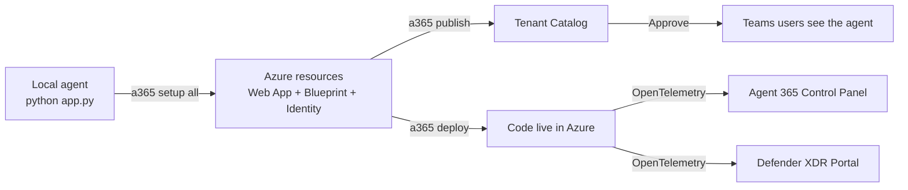

# 🎯 Phase 11 — Wrap Your Agent with Agent 365 (Beginner Lab)

> **Goal**: Take a *fresh*, brand-new agent built with the **Microsoft 365 Agents SDK**, then wrap it with the **Microsoft Agent 365 SDK** so it shows up in the **Agent 365 control panel** and the **Microsoft Defender XDR** portal — with full observability.
>
> **Audience**: Absolute beginners — *no scripting knowledge required*. Every command is given verbatim. If you can copy-paste and click "Save", you can finish this lab.
>
> **Duration**: ~2 hours (mostly waiting for Azure to provision things).

---

## 🍰 What you'll actually do (the 5-minute summary)

1. **Build** a tiny "Hello, world!" agent in Python (10 lines of code — we provide it).
2. **Test** it locally in the *Microsoft 365 Agents Playground* (a built-in chat tester).
3. **Install** the `a365` CLI from Microsoft.
4. **Run one command** (`a365 setup all`) — it creates everything in Azure for you.
5. **Deploy** the agent (`a365 publish` + `a365 deploy`).
6. **Add observability** so traces flow into Agent 365 and Defender XDR.
7. **See it work**: open the **Microsoft Admin Center → Agents**, the **Agent 365 Control Panel**, and the **Defender XDR → Advanced Hunting** view.



---

## 🧠 The two SDKs (one more time — this matters)

| Layer | Name | Phase taught | What it does |
|---|---|---|---|
| Build | **Microsoft 365 Agents SDK** | 1–7 | "Someone sent a message → my code answers." |
| Wrap | **Microsoft Agent 365 SDK** (CLI + runtime) | 8 (theory) and **11 (this lab)** | Gives the agent a tenant identity, governance, observability, and admin-portal visibility. |

In Phase 8 we **read about** the Agent 365 layer. **This phase actually does it.**

---

## 0️⃣ What you need before you start (15 minutes)

Tick each box. If anything fails, fix it before continuing.

- [ ] **Windows 10/11**, macOS, or Linux with at least 4 GB free RAM.
- [ ] **PowerShell 7** (Windows) or **bash/zsh** (Mac/Linux). [Install PS7](https://learn.microsoft.com/powershell/scripting/install/installing-powershell).
- [ ] **VS Code** — <https://code.visualstudio.com/>
- [ ] **Python 3.10 or 3.11** — open a terminal and type `python --version`.
- [ ] **.NET 8 SDK** — the Agent 365 CLI is a .NET tool. [Download](https://dotnet.microsoft.com/download).
- [ ] **Azure CLI** — [Install](https://learn.microsoft.com/cli/azure/install-azure-cli). Verify: `az --version`.
- [ ] An **Azure subscription** where you have at least **Contributor** rights to *one* resource group (the CLI will provision a few small resources — total cost typically under $10/month).
- [ ] A **Microsoft 365 tenant** where:
   - You have at least the **Agent ID Developer** Entra role (the CLI will tell you if you don't and print PowerShell you can give to your admin).
   - The tenant is part of the **Microsoft 365 Frontier preview program** (required while Agent 365 is in preview — your admin signs the tenant up at <https://adoption.microsoft.com/copilot/frontier-program/>).
- [ ] **GitHub account** (so you can later push your project — optional but recommended).

> 💡 If you don't have an Azure subscription, [create a free one](https://azure.microsoft.com/free/) — you get $200 of credit.

---

## 1️⃣ Build the tiny agent (10 minutes)

We'll use the smallest possible agent: it greets the user and echoes whatever they type. This is the same pattern as Phase 1 but cleaned up for wrapping with Agent 365.

### 1.1 Create a project folder

Open a terminal (in VS Code: **Terminal → New Terminal**). Then:

```powershell
# pick any folder you like
cd $HOME
mkdir my-first-a365-agent
cd my-first-a365-agent
code .
```

VS Code opens the folder.

### 1.2 Create a Python virtual environment

```powershell
python -m venv .venv
.\.venv\Scripts\Activate.ps1
```

On macOS/Linux: `source .venv/bin/activate`.

Your prompt now starts with `(.venv)` — that means the environment is active.

### 1.3 Install the SDK

Create [`requirements.txt`](https://github.com/mail2raji/agent-365-sdk-handbook/blob/main/Phase11_Wrap_with_Agent365/code/my-first-a365-agent/requirements.txt) with these lines (we provide it in this lab's `code/` folder — copy/paste):

```text
microsoft-agents-hosting-aiohttp
microsoft-agents-hosting-core
microsoft-agents-activity
python-dotenv
```

Then run:

```powershell
pip install -r requirements.txt
```

Wait ~30 seconds for downloads.

### 1.4 Create the agent code

Create [`app.py`](https://github.com/mail2raji/agent-365-sdk-handbook/blob/main/Phase11_Wrap_with_Agent365/code/my-first-a365-agent/app.py):

```python
"""Tiny Hello-World agent. Phase 11 starter."""
from __future__ import annotations

import logging
import os

from dotenv import load_dotenv
from aiohttp import web

from microsoft_agents.hosting.aiohttp import CloudAdapter
from microsoft_agents.hosting.core import (
    AgentApplication,
    MemoryStorage,
    TurnContext,
    TurnState,
)

load_dotenv()
logging.basicConfig(level=logging.INFO)
log = logging.getLogger("hello-a365")

AGENT_APP = AgentApplication(storage=MemoryStorage())


@AGENT_APP.conversation_update("membersAdded")
async def welcome(context: TurnContext, state: TurnState):
    for m in context.activity.members_added or []:
        if m.id != context.activity.recipient.id:
            await context.send_activity(
                "👋 Hi! I am your first Agent 365 agent. Say anything and I will echo it."
            )


@AGENT_APP.activity("message")
async def echo(context: TurnContext, state: TurnState):
    user_text = context.activity.text or ""
    await context.send_activity(f"You said: {user_text}")


def main() -> None:
    adapter = CloudAdapter()

    async def messages(req: web.Request) -> web.Response:
        return await adapter.process(req, AGENT_APP)

    async def healthz(_req: web.Request) -> web.Response:
        return web.json_response({"ok": True})

    app = web.Application()
    app.router.add_post("/api/messages", messages)
    app.router.add_get("/healthz", healthz)
    port = int(os.environ.get("PORT", 3978))
    log.info("Listening on http://localhost:%s/api/messages", port)
    web.run_app(app, host="0.0.0.0", port=port)


if __name__ == "__main__":
    main()
```

### 1.5 Create a `.env` file for local testing

Copy [`.env.example`](https://github.com/mail2raji/agent-365-sdk-handbook/blob/main/Phase11_Wrap_with_Agent365/code/my-first-a365-agent/.env.example) to `.env`:

```dotenv
CONNECTIONS__SERVICE_CONNECTION__SETTINGS__ANONYMOUS_ALLOWED=True
PORT=3978
```

The first line lets the **Agents Playground** talk to your bot without auth — perfect for local dev.

### 1.6 Run it

```powershell
python app.py
```

You should see:

```text
INFO:hello-a365:Listening on http://localhost:3978/api/messages
```

Leave this running.

### 1.7 Test in the Playground

1. Install the **Microsoft 365 Agents Playground** VS Code extension (search "Microsoft 365 Agents Playground" in VS Code Extensions).
2. Open the **Command Palette** (`Ctrl+Shift+P`) → type `Agents: Open Playground` → choose `http://localhost:3978/api/messages`.
3. Type "hello" → you should see **"You said: hello"**.

🎉 **Milestone 1 — Your bare agent works locally.**

Stop the agent for now (`Ctrl+C` in the terminal).

---

## 2️⃣ Install the Agent 365 CLI (5 minutes)

This is the magic wand that turns your simple agent into a tenant-registered, observable Agent 365 agent.

### 2.1 Verify .NET

```powershell
dotnet --version
```

You need 8.x or newer. If not, install from <https://dotnet.microsoft.com/download>.

### 2.2 Install the CLI

```powershell
dotnet tool install --global Microsoft.Agents.A365.DevTools.Cli --prerelease
```

(If you already have it, run `dotnet tool update --global Microsoft.Agents.A365.DevTools.Cli --prerelease` instead.)

### 2.3 Verify

```powershell
a365 -h
```

You should see the help screen with `setup`, `publish`, `deploy`, `cleanup`, etc.

> ⚠️ The Agent 365 CLI is **preview software**. Commands may evolve. This lab matches the November 2025 / 1.1+ CLI. If a command looks different, run `a365 <command> --help` for the latest syntax.

---

## 3️⃣ Sign in to Azure (2 minutes)

The CLI uses your Azure CLI login for everything (no separate sign-in needed).

```powershell
az login --allow-no-subscriptions
```

A browser opens. Pick the **work account** in your Microsoft 365 tenant (not a personal account). After signing in:

```powershell
az account show --query "{user:user.name, tenantId:tenantId}" -o json
```

You should see your account and the tenant ID. **Copy the tenant ID** — you'll occasionally need it.

> 🔐 Why `--allow-no-subscriptions`? Some Agent 365 paths don't need an Azure subscription at all. This flag prevents the login from failing if your account isn't linked to one.

---

## 4️⃣ The one big command — `a365 setup all` (15 minutes)

This is the heart of the lab. It creates **everything**:

- An **Azure Resource Group** (if none exists).
- An **App Service Plan** + **Web App** to host your agent.
- A **Managed Identity** for the Web App.
- An **Agent 365 Blueprint** in Microsoft Entra ID.
- The **Agent Identity** (so the agent has its own provable identity in your tenant).
- All required **permissions** and admin-consent grants.

### 4.1 First do a *dry-run*

A dry-run shows what *would* happen without actually creating anything. Always do this first.

From inside your project folder (`my-first-a365-agent`):

```powershell
a365 setup all --agent-name my-first-a365-agent --dry-run
```

Read the output. You should see a table of resources the CLI plans to create. Nothing was actually created yet.

> 💡 **Naming rules** for `--agent-name`:
> - Globally unique across Azure.
> - Letters, numbers, hyphens only.
> - 3–20 characters.
> - Starts with a letter.
> - Tip: include your initials so it's unique, e.g. `jdoe-my-first-agent`.

### 4.2 Now do it for real

```powershell
a365 setup all --agent-name my-first-a365-agent
```

You'll see numbered progress steps like `[1/5] Creating resource group…`, `[2/5] Creating web app…`, etc.

> ⏰ This takes **5–10 minutes**. Get a coffee.

#### 4.2.1 Things you might see (and what to do)

| Message | What it means | What to do |
|---|---|---|
| `"Authenticating via Windows Account Manager..."` then silence | A Windows sign-in dialog appeared on your screen | Click the dialog and complete sign-in. The CLI resumes automatically. |
| `Operation cannot be completed without additional quota` | Your subscription is full in that Azure region | Re-run with a different region: add `--location eastus2` (or any other supported region) |
| `Forbidden / Authorization_RequestDenied` | You lack a directory role | The CLI prints a PowerShell script. Hand it to a Global Admin to run. |
| `Permission Grants: granted` ✅ in the summary | You're a lucky admin — everything is consented | Move on. |
| `Permission Grants: needs admin consent` | A Global Admin must approve | The CLI prints a PowerShell script. Copy it to your admin. Then move on. |

### 4.3 Look at the summary table

When it finishes, the CLI prints a **Setup Summary**. It looks like:

```text
┌──────────────────────────┬─────────────────────────────────────────────────────────┐
│ Resource                 │ Value                                                   │
├──────────────────────────┼─────────────────────────────────────────────────────────┤
│ Resource Group           │ my-first-a365-agent-rg                                  │
│ Web App                  │ my-first-a365-agent.azurewebsites.net                   │
│ Agent Blueprint ID       │ a1b2c3d4-...                                            │
│ Agent Identity (App ID)  │ e5f6g7h8-...                                            │
│ Agent Identity SP        │ <object id>                                             │
│ Messaging Endpoint       │ https://my-first-a365-agent.azurewebsites.net/api/...   │
│ Permission Grants        │ granted ✅                                              │
└──────────────────────────┴─────────────────────────────────────────────────────────┘
```

A file called **`a365.generated.config.json`** was created in your project folder. It contains all the IDs above and is used by future `a365` commands.

🎉 **Milestone 2 — Azure resources and Entra blueprint exist.**

---

## 5️⃣ Customize the Teams manifest (5 minutes)

Your agent now has a folder called `manifest/`. The most important file is `manifest/manifest.json`. This is how your agent introduces itself to Teams.

Open `manifest/manifest.json` and edit at least these fields:

| Field | Set it to |
|---|---|
| `name.short` | A friendly name (≤ 30 chars), e.g. `My First A365 Agent` |
| `name.full` | A longer name, e.g. `My First Agent 365 Hello-World Agent` |
| `description.short` | One sentence (≤ 80 chars), e.g. `My first end-to-end Agent 365 lab agent.` |
| `description.full` | A paragraph — what it does, what it can access, any caveats |
| `developer.name` | Your name or your org |
| `developer.websiteUrl` | A real URL (your GitHub profile is fine) |
| `developer.privacyUrl` | A real URL (you can point to your repo's README) |
| `developer.termsOfUseUrl` | A real URL |
| `accentColor` | A hex colour you like, e.g. `#5b53ff` |

> ✋ **Don't touch** the `id` or `agenticUserTemplates[].id` fields — the CLI fills those in for you on `a365 publish`.

You also need two PNG icons in the `manifest/` folder:
- `color.png` — 192×192, your agent's icon.
- `outline.png` — 32×32, a transparent outline.

If you don't have icons yet, use placeholders. The lab includes free ones in [`code/my-first-a365-agent/manifest/`](https://github.com/mail2raji/agent-365-sdk-handbook/blob/main/Phase11_Wrap_with_Agent365/code/my-first-a365-agent/manifest).

---

## 6️⃣ Publish + Deploy (10 minutes)

Two commands.

### 6.1 Publish the manifest to your tenant

```powershell
a365 publish
```

This:

- Updates `manifest.json` with the auto-generated IDs.
- Registers the agent with the Microsoft 365 admin center.

You should see `Publish completed successfully`.

### 6.2 Deploy the code to Azure

```powershell
a365 deploy
```

This:

- Packages your Python project.
- Zip-deploys it to the Azure Web App created in Step 4.
- Sets any required app settings (your `.env` values become Azure App Settings).

It can take 3–5 minutes for the first deployment. Watch for `Deployment completed successfully`.

🎉 **Milestone 3 — Your agent is live in Azure and registered in your tenant.**

### 6.3 Quick sanity check

Open `https://my-first-a365-agent.azurewebsites.net/healthz` (use your actual web-app URL — check `a365.generated.config.json` field `webAppUrl`). You should get `{"ok": true}`.

---

## 7️⃣ Wire the agent to Teams (5 minutes, one-time)

Without this step the agent is "live" but Teams has no way to send messages to it.

### 7.1 Get your Blueprint ID

Open `a365.generated.config.json` and copy `agentBlueprintId`.

### 7.2 Open the Teams Developer Portal

In a browser, go to:

```text
https://dev.teams.microsoft.com/tools/agent-blueprint/<paste-blueprint-id-here>/configuration
```

If you get **Access Denied**, your tenant admin must add you to the **Teams Developer Portal** users or do this step for you.

### 7.3 Configure the blueprint

- **Agent Type** → `API Based`
- **Notification URL** → your messaging endpoint (the value of `messagingEndpoint` in `a365.generated.config.json`, e.g. `https://my-first-a365-agent.azurewebsites.net/api/messages`)
- Click **Save**.

🎉 **Milestone 4 — Teams knows where to deliver messages.**

---

## 8️⃣ Create an agent instance + first chat (10 minutes)

Now that the *blueprint* exists, anyone in your tenant can request an **instance** of it. (Each instance = one running copy of the agent that an admin has approved.)

### 8.1 Request an instance

1. Open **Microsoft Teams** → **Apps**.
2. Search for the name you used in `manifest.json` → `My First A365 Agent`.
3. Open it → click **Request Instance** (the button might say *Create Instance* or *Add* depending on the preview).

### 8.2 Approve in the admin center

1. A Tenant Admin opens <https://admin.cloud.microsoft/#/agents/all/requested>.
2. Find your request → click **Approve**.

> ⏰ Approval is asynchronous. The new agent user can take **a few minutes to a few hours** before it becomes searchable.

### 8.3 Chat

1. In Teams, click **New chat**.
2. Type your agent's display name → pick it from the suggestions.
3. Say "hello" → it should echo `You said: hello`.

🎉 **Milestone 5 — End-to-end conversation through Microsoft 365.**

---

## 9️⃣ Add Agent 365 observability (20 minutes)

So far we have **identity** and **deployment**. Now let's light up **observability** so every turn shows up in the Agent 365 control panel and Defender XDR.

### 9.1 Install the observability package

In your project folder:

```powershell
pip install microsoft-opentelemetry
```

Also add it to `requirements.txt` so deployments include it:

```text
microsoft-agents-hosting-aiohttp
microsoft-agents-hosting-core
microsoft-agents-activity
python-dotenv
microsoft-opentelemetry
```

### 9.2 Wire it into `app.py`

Open `app.py` and **add three things** (full reference: [`code/my-first-a365-agent/app.py`](https://github.com/mail2raji/agent-365-sdk-handbook/blob/main/Phase11_Wrap_with_Agent365/code/my-first-a365-agent/app.py) after observability):

1. **Imports**:

   ```python
   from microsoft.opentelemetry import use_microsoft_opentelemetry  # A365 Observability
   from microsoft.opentelemetry.a365.core import BaggageBuilder
   from microsoft.opentelemetry.a365.hosting.scope_helpers.populate_baggage import populate
   from microsoft.opentelemetry.a365.hosting.token_cache_helpers import (
       AgenticTokenCache,
       AgenticTokenStruct,
   )
   from microsoft.opentelemetry.a365.runtime import get_observability_authentication_scope
   ```

2. **One call near the top of `main()`** (right after `load_dotenv()`):

   ```python
   use_microsoft_opentelemetry(
       service_name="my-first-a365-agent",
       enable_a365=True,
       a365_token_resolver=AgenticTokenCache().get_cached_token,
   )
   ```

3. **Wrap your message handler body** so every turn is a trace:

   ```python
   @AGENT_APP.activity("message")
   async def echo(context: TurnContext, state: TurnState):
       # A365 Observability — register a per-turn token (OBO mode)
       token_cache = AgenticTokenCache()
       try:
           token_cache.register_observability(
               agent_id=context.activity.recipient.agentic_app_id,
               tenant_id=context.activity.recipient.tenant_id,
               token_generator=AgenticTokenStruct(
                   authorization=None,           # OBO: SDK injects user token
                   turn_context=context,
               ),
               observability_scopes=get_observability_authentication_scope(),
           )
       except Exception as e:
           log.warning("A365 observability token registration failed: %s", e)

       builder = BaggageBuilder()
       populate(builder, context)
       with builder.build():
           user_text = context.activity.text or ""
           await context.send_activity(f"You said: {user_text}")
   ```

> 💡 The pattern above is **OBO (on-behalf-of-the-user)** mode — the simplest. For S2S/autonomous agents see [Phase 8](../Phase8_Agent365_Enterprise/README.md).

### 9.3 Enable the exporter in `.env`

Add this line to `.env`:

```dotenv
ENABLE_A365_OBSERVABILITY_EXPORTER=true
```

> Set to `false` while developing locally if you don't want noise. In Azure, it's `true`.

### 9.4 Redeploy

```powershell
a365 deploy
```

When it finishes, send another message in Teams (e.g. "test 1") so a new trace is generated.

🎉 **Milestone 6 — Traces are flowing to the Agent 365 observability service.**

---

## 🔟 Validate in the portals (15 minutes)

### 10.1 Microsoft 365 Admin Center → Agents

1. Open <https://admin.cloud.microsoft/#/agents/all>.
2. You should see your agent listed.
3. Click it → check the **Activity** and **Permissions** tabs.

### 10.2 Agent 365 Control Panel

1. Open <https://admin.cloud.microsoft/#/agents> (or the **Agent 365** card from the admin home).
2. Pick your agent → **Telemetry / Observability** tab.
3. You should see at least one **turn** (the message you just sent). Click it to expand → you'll see spans for the activity, baggage attributes like `tenantId` and `conversationId`, and any LLM/tool spans (if you added them in Phase 6).

> ⏰ Spans can take **1–5 minutes** to appear.

### 10.3 Microsoft Defender XDR

Defender XDR ingests Agent 365 telemetry into the **`CloudAppEvents`** advanced-hunting table. The agent-specific fields are nested inside `RawEventData`, so the canonical lookup keys off your agent's **app id** (not a display name).

> ℹ️ **Prerequisite.** Open **Defender portal → Settings → Cloud apps → App connectors** and make sure the **Microsoft 365 activities** checkbox is on. Otherwise `CloudAppEvents` is empty for every query. See [Connect Microsoft 365 to Defender for Cloud Apps](https://learn.microsoft.com/defender-cloud-apps/protect-office-365#prerequisites).

1. Open <https://security.microsoft.com>.
2. In the left nav: **Hunting → Advanced hunting**.
3. Grab your agent's app id from `a365.generated.config.json` (`agentIdentity.appId`).
4. Paste this KQL query (replace the placeholder GUID):

   ```kusto
   // Source: https://learn.microsoft.com/microsoft-agent-365/developer/direct-open-telemetry-troubleshooting#verifying-ingestion
   let agentIdToFind = "<your-agent-app-id-guid>";
   CloudAppEvents
   | where Timestamp > ago(1d)
   | where ActionType in ("InvokeAgent", "InferenceCall",
                          "ExecuteToolBySDK", "ExecuteToolByGateway", "ExecuteToolByMCPServer")
   | extend resData       = parse_json(tostring(RawEventData))
   | extend AgentId       = tostring(resData.AgentId)
   | extend TargetAgentId = tostring(resData.TargetAgentId)
   | extend AlternateId   = tostring(resData.PlatformTargetAgentId)
   | where AgentId == agentIdToFind
        or TargetAgentId == agentIdToFind
        or AlternateId == agentIdToFind
   | project Timestamp, ActionType, AccountDisplayName,
             ConversationId = tostring(resData.ConversationId), resData
   | top 50 by Timestamp desc
   ```

5. Click **Run query**.
6. You should see rows for your turns: timestamp, action type (`InvokeAgent`, `ExecuteToolBySDK`, etc.), the calling user (`AccountDisplayName`), and the full per-span payload in `resData`.

> 💡 If `CloudAppEvents` is empty, wait a few minutes and retry. First-time ingestion can lag **5–15 minutes** — and only runs that emit an `invoke_agent` root span show up in the agent-activity views (other operations are still queryable here).

### 10.4 Alerting (bonus)

In Defender XDR, you can build **custom detection rules** from KQL — e.g. "alert me if any agent sends more than 100 invocations in 10 minutes". Try:

```kusto
CloudAppEvents
| where Timestamp > ago(10m)
| where ActionType == "InvokeAgent"
| extend AgentId = tostring(parse_json(tostring(RawEventData)).AgentId)
| summarize msgs = count() by AgentId
| where msgs > 100
```

Click **Create detection rule** to save it.

🎉 **Milestone 7 — Your agent is visible in *both* the Agent 365 Control Panel and Defender XDR.**

---

## ✅ End-to-end checklist

You have **wrapped** a bare M365 Agents SDK agent with the Agent 365 enterprise layer when *all* of the following are true:

- [ ] `python app.py` runs locally without errors.
- [ ] `a365 setup all` finished with `Permission Grants: granted` (or you ran the admin consent script).
- [ ] `a365 publish` and `a365 deploy` both reported success.
- [ ] The Teams Developer Portal **Notification URL** is set and saved.
- [ ] An admin **approved** your instance request.
- [ ] You can send a message in Teams and the bot replies.
- [ ] Your agent appears in **M365 Admin Center → Agents**.
- [ ] **Agent 365 Control Panel** shows at least one trace.
- [ ] Defender XDR `CloudAppEvents` query (filtered by your agent's app id) returns rows.

---

## 🧹 Cleanup (optional)

When you're done experimenting, delete the Azure resources to stop incurring cost:

```powershell
a365 cleanup azure --agent-name my-first-a365-agent
a365 cleanup blueprint --agent-name my-first-a365-agent
```

This removes the resource group, web app, and the Entra blueprint. **It does NOT delete approved agent instances** — those are removed by an admin in the M365 admin center.

---

## 🆘 Troubleshooting cheat sheet

| Problem | Fix |
|---|---|
| `a365: command not found` | Re-open the terminal so PATH updates pick up. Or run `dotnet tool list -g` to confirm install. |
| Teams can't find the agent | Wait — agent-user creation is async (minutes to hours). |
| Browser sign-in keeps looping | Wrong account selected. Sign out, re-run `az login --allow-no-subscriptions`, pick the **work** account in the right tenant. |
| Bot is "live" but doesn't reply in Teams | The Notification URL in Teams Developer Portal is wrong or missing. |
| `Forbidden` during `setup all` | You're missing the Entra role. Hand the printed PowerShell script to your tenant admin. |
| No traces in Agent 365 Control Panel | (1) `ENABLE_A365_OBSERVABILITY_EXPORTER=true` set? (2) Redeployed? (3) `OtelWrite` app role granted to your Agent Identity (the CLI prints the script if not). |
| KQL returns no rows in Defender XDR | Wait 5–15 minutes after the first turn. Confirm the agent name spelling. |
| `cleanup` partially fails | Re-run; both cleanup commands are idempotent. |

For deeper issues, see the [Agent 365 Troubleshooting Guide](https://learn.microsoft.com/en-us/microsoft-agent-365/developer/troubleshooting).

---

## 🚀 What's next?

You now have **everything** Phases 1–10 taught — plugged into a real, observable, governed agent.

- Go back to [Phase 5 (LLM)](../Phase5_LLM_Integration/README.md) and **add Azure OpenAI** to this agent.
- Add [Phase 6 tools](../Phase6_Tools_and_RAG/README.md) and watch them light up as `ExecuteToolScope` spans in the Control Panel.
- Try the [Phase 10 Capstone](../Phase10_Capstone/README.md) — same blueprint, real-world use case.
- Browse the official samples: <https://github.com/microsoft/Agent365-Samples/tree/main/python>.

---

## 📚 References

- Agent 365 guided setup: <https://github.com/microsoft/Agent365-devTools/tree/main/docs/agent365-guided-setup>
- Agent 365 CLI reference: <https://learn.microsoft.com/microsoft-agent-365/developer/agent-365-cli>
- Agent 365 observability: <https://learn.microsoft.com/microsoft-agent-365/developer/observability>
- Defender XDR Advanced Hunting: <https://learn.microsoft.com/defender-xdr/advanced-hunting-overview>
- M365 Frontier program: <https://adoption.microsoft.com/copilot/frontier-program/>

Continue your learning → [exercises.md](exercises.md)
