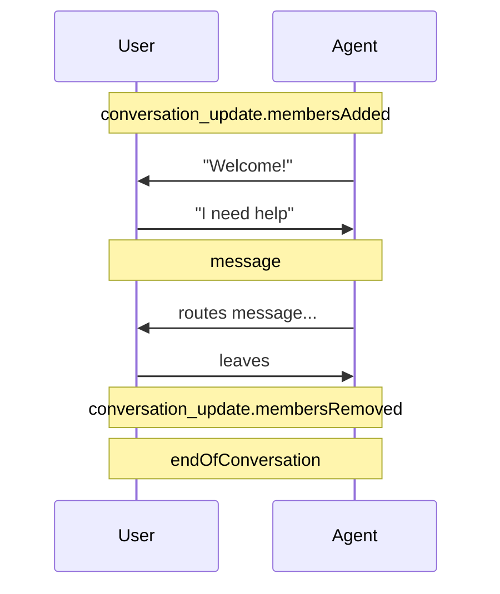

# 🐥 Phase 2 — Activities & Handlers

> **Goal**: Master the four handler decorators and build a **Help-Desk Router** that routes user requests to the right team.

**Duration**: ~60 minutes.

---

## 📚 What you'll learn

1. All four handler decorators: `@message`, `@activity`, `@conversation_update`, and the generic catch-all.
2. Matching with strings, lists of strings, regex, and case-insensitively.
3. The full lifecycle: `members_added`, `members_removed`, `endOfConversation`.
4. Real-world routing pattern: keyword → team handover.

---

## 1️⃣ The four ways to register a handler

| Decorator | Fires on | Example |
|---|---|---|
| `@AGENT_APP.message("text")` | A message activity whose `text` matches | "/help", "reset" |
| `@AGENT_APP.message(re.compile(...))` | A message whose text matches a regex | `^order \d+$` |
| `@AGENT_APP.activity("type")` | Any activity of a specific type | "message", "event", "typing", "messageReaction" |
| `@AGENT_APP.conversation_update("event")` | Members joining/leaving | "membersAdded", "membersRemoved" |

You can also pass a **list** of patterns to `@message`:

```python
@AGENT_APP.message(["hi", "hello", "hey", re.compile(r"^howdy.*", re.I)])
async def on_greet(context, state):
    await context.send_activity("Hi there!")
```

---

## 2️⃣ Specificity wins — the routing order rule

The SDK evaluates routes **in the order you registered them**. If two routes match, the **first one wins**. Therefore:

> ✅ **Always register your specific routes before your catch-all.**

Bad:

```python
@AGENT_APP.activity("message")              # catch-all
async def echo(...): ...

@AGENT_APP.message("/help")                 # too late — never runs
async def help(...): ...
```

Good:

```python
@AGENT_APP.message("/help")
async def help(...): ...

@AGENT_APP.activity("message")              # only runs if /help didn't match
async def echo(...): ...
```

---

## 3️⃣ Conversation lifecycle



```python
@AGENT_APP.conversation_update("membersAdded")
async def on_join(context, state):
    for m in context.activity.members_added or []:
        if m.id != context.activity.recipient.id:
            await context.send_activity(f"Welcome {m.name}!")

@AGENT_APP.conversation_update("membersRemoved")
async def on_leave(context, state):
    for m in context.activity.members_removed or []:
        print(f"{m.name} left.")

@AGENT_APP.activity("endOfConversation")
async def on_end(context, state):
    print("Conversation ended.")
```

> 👶 Members aren't only humans — the bot itself counts as a "member". Always skip the bot ID when greeting (`m.id != context.activity.recipient.id`).

---

## 4️⃣ Real-world example: Help-Desk Router

**Scenario**: You work at "Contoso Inc." and want a single chat agent that routes employees to the right team based on keywords.

| User says | Route to |
|---|---|
| "reset password", "locked out" | IT |
| "payslip", "leave balance" | HR |
| "expense", "invoice" | Finance |
| Anything else | Show menu |

### The code

[`code/helpdesk_router/app.py`](https://github.com/mail2raji/agent-365-sdk-handbook/blob/main/Phase2_Activities_and_Handlers/code/helpdesk_router/app.py)

```python
"""Help-Desk Router — Phase 2 example."""
from __future__ import annotations

import re
import logging

from microsoft_agents.hosting.core import (
    AgentApplication, MemoryStorage, TurnContext, TurnState,
)
from start_server import start_server

logging.basicConfig(level=logging.INFO)
log = logging.getLogger("helpdesk")

AGENT_APP = AgentApplication(storage=MemoryStorage())


MENU = (
    "👋 Hi! I'm the Contoso Help-Desk agent. Tell me what you need:\n"
    "- 🔐 *password*, *locked out* → IT\n"
    "- 💼 *payslip*, *leave balance* → HR\n"
    "- 💰 *expense*, *invoice* → Finance"
)


# --- Welcome ---
@AGENT_APP.conversation_update("membersAdded")
async def welcome(context: TurnContext, _state: TurnState) -> None:
    for m in context.activity.members_added or []:
        if m.id != context.activity.recipient.id:
            await context.send_activity(MENU)


# --- IT: regex with case-insensitive flag ---
IT_REGEX = re.compile(r"\b(reset\s+password|locked\s+out|mfa)\b", re.IGNORECASE)

@AGENT_APP.message(IT_REGEX)
async def route_it(context: TurnContext, _state: TurnState) -> None:
    log.info("Routing to IT")
    await context.send_activity(
        "🔐 Connecting you to **IT**. Reset link: https://aka.ms/reset"
    )


# --- HR: list of keywords ---
HR_TRIGGERS = ["payslip", "leave balance", "vacation days"]

@AGENT_APP.message(HR_TRIGGERS)
async def route_hr(context: TurnContext, _state: TurnState) -> None:
    log.info("Routing to HR")
    await context.send_activity("💼 Connecting you to **HR**. Check the HR portal.")


# --- Finance: exact words ---
@AGENT_APP.message(["expense", "invoice", "reimbursement"])
async def route_finance(context: TurnContext, _state: TurnState) -> None:
    log.info("Routing to Finance")
    await context.send_activity("💰 Connecting you to **Finance**.")


# --- Default: show menu (catch-all, registered LAST) ---
@AGENT_APP.activity("message")
async def default(context: TurnContext, _state: TurnState) -> None:
    await context.send_activity(
        f"I don't know how to help with: *{context.activity.text}*\n\n{MENU}"
    )


if __name__ == "__main__":
    start_server(AGENT_APP, None)
```

### Run & test

```powershell
cd Phase2_Activities_and_Handlers\code\helpdesk_router
python app.py
```

In another terminal try (using the same `Invoke-RestMethod` pattern from Phase 1):

| Text | Expected route |
|---|---|
| "I forgot my password — locked out" | IT |
| "Send me my latest payslip" | HR |
| "Submit expense" | Finance |
| "What's the weather?" | Default menu |

---

## 5️⃣ Pattern: list + regex combo

You can mix string keywords **and** regex in the same handler list:

```python
@AGENT_APP.message([
    "hi", "hello",
    re.compile(r"good\s+(morning|afternoon|evening)", re.IGNORECASE),
])
async def greet(context, state):
    await context.send_activity(f"Hi {context.activity.from_property.name or 'there'}!")
```

---

## 6️⃣ Sending more than just text

`context.send_activity()` accepts:

- A plain `str` → wrapped as a text message.
- An `Activity` object → for advanced control.
- A list of activities → sent in order.

```python
from microsoft_agents.activity import Activity, ActivityTypes

await context.send_activity(Activity(
    type=ActivityTypes.MESSAGE,
    text="Done!",
    text_format="markdown",     # render **bold**, *italics*, etc.
    speak="Done!",              # spoken text for voice channels
))
```

---

## 7️⃣ Reading & writing the activity directly

Sometimes you want the raw text, mentions, channel data, or attachments:

```python
@AGENT_APP.activity("message")
async def inspect(context, state):
    a = context.activity
    print("type:        ", a.type)
    print("text:        ", a.text)
    print("from:        ", a.from_property.id, a.from_property.name)
    print("conversation:", a.conversation.id)
    print("channel:     ", a.channel_id)
    print("attachments: ", a.attachments)        # files, cards, images
    print("entities:    ", a.entities)           # mentions, locations
    print("channelData: ", a.channel_data)       # channel-specific extras
```

---

## ✅ Phase 2 checklist

- [ ] You can register **specific → general** routes correctly.
- [ ] You used regex, lists, and exact-string matching at least once.
- [ ] Your Help-Desk Router routes 4 different keywords to 4 different responses.
- [ ] You inspected the raw `context.activity` and understand its fields.
- [ ] You completed [exercises.md](exercises.md).

Next → [Phase 3 — State & Storage](../Phase3_State_and_Storage/README.md)
