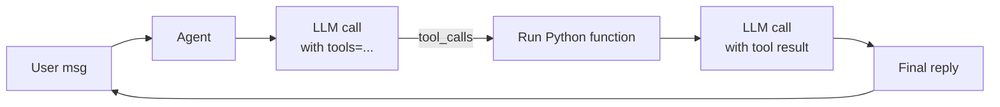
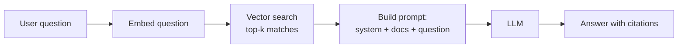
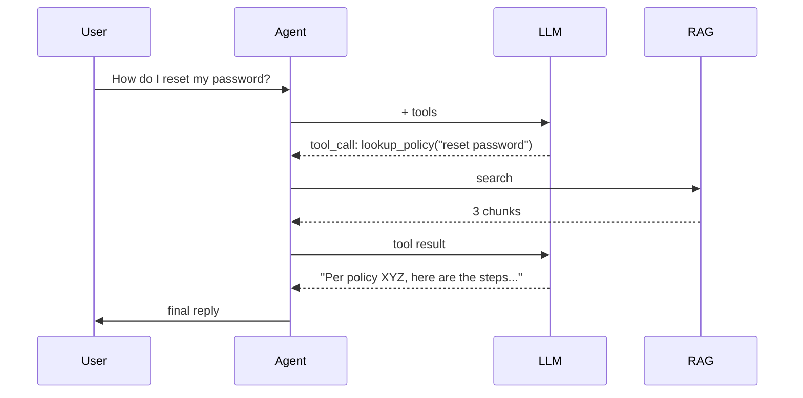

# 🛠️ Phase 6 — Tools & RAG

> **Goal**: Give your AI agent two superpowers — **tools** (functions it can call) and **RAG** (Retrieval-Augmented Generation, so it can answer from *your* documents).

**Duration**: ~120 minutes.
**Scenario**: An **IT Knowledge Agent** that can (a) check the weather via a tool, (b) reset a fake password via a tool, and (c) answer policy questions by searching an in-memory knowledge base.

---

## 📚 What you'll learn

1. **Function calling** — the model decides when to invoke a Python function.
2. The **tool loop** pattern (model → tool → model → user).
3. **RAG basics** — chunk → embed → retrieve → answer.
4. A tiny **in-memory vector store** (so you can run today, no Azure AI Search needed).
5. How to upgrade to Azure AI Search later.

---

## 1️⃣ The big picture



Two trips to the model:

1. First trip: model says "I want to call `get_weather('Berlin')`".
2. You run the function locally, get `"22°C, sunny"`.
3. Second trip: model uses that result to write a friendly reply.

---

## 2️⃣ Tool definitions

A tool = a JSON schema describing a Python function.

```python
TOOLS = [
    {
        "type": "function",
        "function": {
            "name": "get_weather",
            "description": "Get current weather for a city.",
            "parameters": {
                "type": "object",
                "properties": {
                    "city": {"type": "string", "description": "City name."}
                },
                "required": ["city"],
            },
        },
    },
    {
        "type": "function",
        "function": {
            "name": "reset_password",
            "description": "Reset the user's password and email them a temporary one.",
            "parameters": {
                "type": "object",
                "properties": {
                    "user_email": {"type": "string"},
                },
                "required": ["user_email"],
            },
        },
    },
]
```

And the matching Python:

```python
def get_weather(city: str) -> str:
    # mock
    return f"It's 22°C and sunny in {city}."

def reset_password(user_email: str) -> str:
    return f"Done. A temporary password was emailed to {user_email}."

DISPATCH = {"get_weather": get_weather, "reset_password": reset_password}
```

---

## 3️⃣ The tool loop in code

```python
import json
from openai import AsyncAzureOpenAI

async def run_with_tools(history, user_msg):
    history.append({"role": "user", "content": user_msg})
    while True:
        resp = await client.chat.completions.create(
            model=DEPLOYMENT,
            messages=history,
            tools=TOOLS,
            tool_choice="auto",
        )
        msg = resp.choices[0].message
        history.append(msg.model_dump())   # store assistant turn (incl. any tool_calls)
        if not msg.tool_calls:
            return msg.content              # final answer

        # run every requested tool, append tool results, loop again
        for call in msg.tool_calls:
            fn = DISPATCH[call.function.name]
            args = json.loads(call.function.arguments)
            result = fn(**args)
            history.append({
                "role": "tool",
                "tool_call_id": call.id,
                "content": result,
            })
```

The loop ends when the model returns no more `tool_calls` — meaning it has enough info to give a final reply.

---

## 4️⃣ RAG — search your own docs

When users ask "What is our password policy?", the model alone has no idea. RAG works like this:



### Step 1: chunk your docs

Split big docs into ~500-token pieces. Smaller = more precise; larger = more context.

### Step 2: embed each chunk

An **embedding** is a list of ~1500 numbers that represents meaning. Two chunks with similar meaning have similar vectors.

```python
emb = await client.embeddings.create(
    model="text-embedding-3-small",
    input=["Password policy: rotate every 90 days."],
)
vector = emb.data[0].embedding   # list[float], length 1536
```

### Step 3: retrieve top-k

Compute the question's embedding, then find chunks with the smallest **cosine distance**.

### Step 4: build the prompt

```python
prompt = (
    "Answer using ONLY the docs below. If the answer isn't there, say so.\n\n"
    + "\n---\n".join(top_chunks)
    + f"\n\nQuestion: {user_q}"
)
```

This grounds the model in your data and prevents hallucination.

---

## 5️⃣ Tiny in-memory vector store

[`code/knowledge_agent/rag.py`](https://github.com/mail2raji/agent-365-sdk-handbook/blob/main/Phase6_Tools_and_RAG/code/knowledge_agent/rag.py) — full file is below. It uses NumPy for cosine similarity and stores everything in RAM. Perfect for learning. For production swap in **Azure AI Search**, **Pinecone**, **Qdrant**, etc.

---

## 6️⃣ Putting it together

[`code/knowledge_agent/app.py`](https://github.com/mail2raji/agent-365-sdk-handbook/blob/main/Phase6_Tools_and_RAG/code/knowledge_agent/app.py) wires:

- A tool: `lookup_policy(question)` — runs RAG and returns a short context block.
- A tool: `reset_password(user_email)` — mock action.
- A tool: `get_weather(city)` — mock action.
- The chat loop calls these on-demand.



Run:

```powershell
cd Phase6_Tools_and_RAG\code\knowledge_agent
Copy-Item .env.example .env       # then fill in your keys
python app.py
```

Try:

1. "What is our password rotation policy?"  → triggers `lookup_policy`.
2. "Reset my password for jane@contoso.com." → triggers `reset_password`.
3. "What's the weather in Tokyo?" → triggers `get_weather`.
4. "Tell me a joke." → no tool, just a reply.

---

## 7️⃣ Upgrading to Azure AI Search

When your knowledge base grows past ~100 docs, in-memory math gets slow. Switch to **Azure AI Search**:

```python
from azure.search.documents.aio import SearchClient
from azure.core.credentials import AzureKeyCredential

search = SearchClient(
    endpoint=os.environ["AZURE_SEARCH_ENDPOINT"],
    index_name=os.environ["AZURE_SEARCH_INDEX"],
    credential=AzureKeyCredential(os.environ["AZURE_SEARCH_KEY"]),
)

results = await search.search(
    search_text=None,
    vector_queries=[VectorizedQuery(vector=q_vec, k_nearest_neighbors=4, fields="contentVector")],
)
```

Same idea, just delegated to a managed service.

---

## 8️⃣ Gotchas

| Symptom | Cause / fix |
|---|---|
| Model never calls a tool | Description too vague — make `description` explicit ("Use when the user asks…"). |
| Wrong arguments | JSON schema too loose — add `enum`, `format`, `pattern` constraints. |
| Infinite loop | Always exit loop when `msg.tool_calls is None`; cap iterations (e.g. 5). |
| RAG cites nothing | Top-k too small or chunk too big; raise `k`, shrink chunk size. |
| Hallucinated facts | System prompt must say "Use only the docs". |

---

## ✅ Phase 6 checklist

- [ ] The model picks `get_weather` for weather questions.
- [ ] The model picks `lookup_policy` for policy questions and quotes the doc.
- [ ] You added at least one new tool of your own.
- [ ] You completed [exercises.md](exercises.md).

Next → [Phase 7 — Multi-channel, Teams & Auth](../Phase7_Channels_Teams_Auth/README.md)
