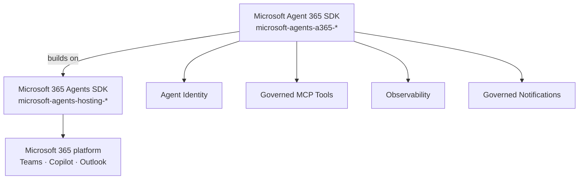

# 🏢 Phase 8 — Agent 365 Enterprise Layer

> **Goal**: Understand and use the **Microsoft Agent 365 SDK** — the enterprise layer that adds identity, governance, observability, governed MCP tools and notifications on top of the Microsoft 365 Agents SDK from Phases 1–7.

**Duration**: ~150 minutes.
**Scenario**: A **Governed Helpdesk Agent** that ships with a verified agent identity, emits OpenTelemetry traces, and exposes a governed MCP tool.

> ⚠️ The Agent 365 SDK is currently **preview / pre-release**. Install commands below use `--prerelease=allow` (uv) or `--pre` (pip). APIs may change.

---

## 📚 What you'll learn

1. The difference between **Microsoft 365 Agents SDK** (Phases 1–7) and **Microsoft Agent 365 SDK** (this phase).
2. **Agent identity** (`a365 identity`) — provable, governed agents.
3. **Governed MCP** — tools your enterprise approves once, then any agent can use safely.
4. **A365 notifications** — sending governed Adaptive Card messages.
5. **A365 observability** — OpenTelemetry traces with one import.
6. The `a365` CLI.

---

## 1️⃣ Two SDKs in one picture



| Layer | Package prefix | Purpose |
|---|---|---|
| **Foundation** | `microsoft-agents-hosting-*`, `microsoft-agents-activity` | What you've used so far — handlers, state, channels. |
| **Enterprise** | `microsoft-agents-a365-*` | Identity, MCP, notifications, observability. |

**Rule of thumb**: build with the foundation SDK first. Add A365 packages when you need enterprise governance — auditable identity, observability, or to call governed tools.

---

## 2️⃣ Install

We use **uv** because A365 packages are pre-release.

```powershell
# Once per machine
pip install uv

# Inside your venv (Phase 0)
uv pip install --prerelease=allow `
    microsoft-agents-a365-identity `
    microsoft-agents-a365-mcp `
    microsoft-agents-a365-notifications `
    microsoft-agents-a365-observability-otlp
```

These are also in [`../requirements.txt`](https://github.com/mail2raji/agent-365-sdk-handbook/blob/main/requirements.txt) under the **Phase 8** section (commented out by default).

The `a365` CLI ships with `microsoft-agents-a365-cli`:

```powershell
uv pip install --prerelease=allow microsoft-agents-a365-cli
a365 --help
```

Common commands:

| Command | Purpose |
|---|---|
| `a365 identity create` | Provision an Agent 365 identity (registers metadata, certs, scopes). |
| `a365 identity list` | List identities in your tenant. |
| `a365 mcp register` | Register a governed MCP tool from a manifest. |
| `a365 notifications send` | Send a notification card to a user/channel. |
| `a365 observability bind` | Attach an OTLP endpoint to an agent. |

> ℹ️ Exact subcommands may evolve in preview — always run `a365 <area> --help`.

---

## 3️⃣ Agent identity

In Phase 7 the agent had a Bot App Registration. That's a basic Entra app — anyone with the client id/secret can impersonate the agent.

**Agent 365 identity** is richer:

- Registered with metadata (display name, owner, lifecycle, intended scopes).
- Tied to a **provable cryptographic key** (the SDK signs activity envelopes).
- Auditable: every action the agent takes is attributable to *that* identity in Microsoft Purview.
- Subject to admin policy (which tenants can call it, what data scopes it can use, etc.).

Wire it in code:

```python
from microsoft_agents_a365.identity import AgentIdentity

identity = AgentIdentity.from_env()  # reads A365_IDENTITY_CLIENT_ID, A365_IDENTITY_KEY_PATH, ...
AGENT_APP = AgentApplication(storage=MemoryStorage(), identity=identity)
```

Env vars expected (set in `.env`):

```dotenv
A365_IDENTITY_CLIENT_ID=...
A365_IDENTITY_TENANT_ID=...
A365_IDENTITY_KEY_PATH=./certs/agent-identity.pem
```

`a365 identity create` writes these and creates the cert for you.

---

## 4️⃣ Governed MCP tools

**MCP** (Model Context Protocol) is an open protocol where servers expose tools (functions, resources, prompts) and clients (your agent) consume them.

**Governed MCP** in Agent 365:

- The admin **approves** an MCP server in their tenant once.
- The catalog stores its endpoint, schema, scopes, and required permissions.
- Your agent **discovers** the tool by name (no hard-coded URL).
- Each call is logged and scoped to the agent identity.

```python
from microsoft_agents_a365.mcp import McpToolset

# Discover all governed MCP tools the agent has access to
toolset = await McpToolset.from_catalog(identity)

# tools is a list of LLM tool schemas (the same shape you used in Phase 6)
tools = toolset.openai_tools()

# Invoking a tool by name dispatches through the governed catalog
async def call(name, args):
    return await toolset.invoke(name, args)
```

You drop this into the **same** tool loop from Phase 6 — no code change in the loop itself, only where `TOOLS` and `call_tool` come from.

### Register your own MCP tool

Define a manifest (`mcp_tool.yaml`):

```yaml
name: ticket-lookup
description: Look up an IT support ticket by ID.
endpoint: https://mcp.contoso.com/ticket-lookup
schema:
  type: object
  properties:
    ticket_id: { type: string }
  required: [ticket_id]
scopes: [tickets.read]
```

Register it:

```powershell
a365 mcp register --manifest mcp_tool.yaml
```

Admin approves it once in the portal; every agent in the tenant can now discover it.

---

## 5️⃣ A365 notifications

In Phase 4 you sent Adaptive Cards. A365 notifications add:

- **Routing**: send to a user, group, channel, or audience.
- **Governance**: rate limits, content policy checks, audit.
- **Templating**: server-side template fill-in (`{user.firstName}` etc.).

```python
from microsoft_agents_a365.notifications import NotificationClient, Notification

notifier = NotificationClient(identity)

await notifier.send(
    Notification(
        template_id="weekly-summary-v1",
        audience={"user_aad_oid": user_oid},
        data={"tickets_open": 3, "avg_resolution_hours": 18.5},
    )
)
```

Define `weekly-summary-v1` as an Adaptive Card template (with `{tickets_open}` placeholders) and register it via `a365 notifications template register`.

---

## 6️⃣ A365 observability — OpenTelemetry in one import

```python
from microsoft_agents_a365.observability.otlp import configure_otel

configure_otel(
    service_name="helpdesk-agent",
    endpoint=os.environ["OTEL_EXPORTER_OTLP_ENDPOINT"],   # e.g. App Insights or Grafana
)
```

That single call:

- Auto-instruments the SDK (every handler invocation is a span).
- Auto-instruments `httpx`, `openai`, MCP calls.
- Emits **traces**, **metrics** (LLM tokens, latency), and **logs** via OTLP.

Plug into App Insights with:

```dotenv
OTEL_EXPORTER_OTLP_ENDPOINT=https://eastus.in.applicationinsights.azure.com/
AZURE_APP_INSIGHTS_CONNECTION_STRING=InstrumentationKey=...;IngestionEndpoint=...
```

Then in Azure Monitor → Application Map you see every turn end-to-end.

---

## 7️⃣ Putting it together

[`code/governed_helpdesk_agent/app.py`](https://github.com/mail2raji/agent-365-sdk-handbook/blob/main/Phase8_Agent365_Enterprise/code/governed_helpdesk_agent/app.py) shows the full wiring. Imports of `microsoft_agents_a365` are guarded with `try/except`, so the file still loads if you haven't installed the pre-release packages yet — it will degrade to the Phase 6 behavior.

```python
@AGENT_APP.activity("message")
async def chat(context, state):
    history = state.conversation.get("history", [])
    # toolset comes from governed catalog, not hard-coded
    reply = await chat_with_tools(history, context.activity.text or "", toolset)
    state.conversation["history"] = history
    await context.send_activity(reply)
```

Run:

```powershell
cd Phase8_Agent365_Enterprise\code\governed_helpdesk_agent
Copy-Item .env.example .env       # fill in keys, identity, OTLP
python app.py
```

---

## 8️⃣ When to use what

| Need | Use |
|---|---|
| Build any conversational agent | Foundation SDK (Phases 1–7) |
| Add an LLM | `openai` (Phase 5) |
| Call your own functions | Local tools (Phase 6) |
| Run agent inside Teams | Foundation + Teams package (Phase 7) |
| **Prove the agent's identity and audit its actions** | Agent 365 identity |
| **Reuse tools governed by your admin team** | Agent 365 MCP |
| **Send templated, audited notifications** | Agent 365 notifications |
| **End-to-end OpenTelemetry traces** | Agent 365 observability |

---

## 9️⃣ Gotchas

| Symptom | Cause / fix |
|---|---|
| `pip install microsoft-agents-a365-*` fails | Add `--pre`, or use `uv pip install --prerelease=allow`. |
| `a365: command not found` | Install `microsoft-agents-a365-cli` and ensure your venv is active. |
| `AgentIdentity.from_env()` raises | Missing `A365_IDENTITY_*` vars; re-run `a365 identity create`. |
| Governed MCP tool not discovered | Admin hasn't approved it in the catalog yet. |
| No spans in App Insights | OTLP endpoint not reachable, or connection string wrong. |
| Notification rejected | Template not registered, or audience scope blocked by policy. |

---

## ✅ Phase 8 checklist

- [ ] You can explain the two SDKs and when to add A365.
- [ ] You created an A365 identity via the CLI (or understand the flow).
- [ ] You wired `McpToolset` into a tool loop.
- [ ] You can see traces from your agent in App Insights or another OTLP backend.
- [ ] You completed [exercises.md](exercises.md).

Next → [Phase 9 — Testing & Deployment](../Phase9_Testing_and_Deployment/README.md)
