# 🎓 Agent 365 SDK — Beginner to Advanced Curriculum (Python)

> **Audience**: Absolute beginners with basic Python knowledge.
> **Goal**: Take you from "what is an agent?" to shipping a production-grade, enterprise-governed AI agent on Microsoft 365.
> **Style**: Explained as if you were five years old. Real-world scenarios. Lots of small exercises with full answers.

---

## 🍰 The two SDKs you'll learn (don't confuse them!)

The name **"Agent 365 SDK"** is used in two places. They are **different** but **work together**:

| # | Official name | What it is (kid-friendly) | Python packages |
|---|---|---|---|
| 1 | **Microsoft 365 Agents SDK** | The **kitchen** where you build the agent. Handles "someone sent a message → my code answers". | `microsoft-agents-hosting-aiohttp`, `microsoft-agents-hosting-core`, `microsoft-agents-activity`, `microsoft-agents-hosting-teams`, … |
| 2 | **Microsoft Agent 365 SDK** | The **uniform and badge** an agent wears to work safely inside a real company (identity, audit logs, governed access to mail/calendar, notifications, observability). | `microsoft-agents-a365-runtime`, `microsoft-agents-a365-observability-*`, `microsoft-agents-a365-notifications`, `microsoft-agents-a365-tooling` |

👉 **Phase 0–7** teach #1 (build the agent).
👉 **Phase 8** layers #2 on top (make it enterprise-ready).
👉 **Phase 9–10** wire it all together, test, and deploy.
👉 **Phase 11** is a *hands-on lab* that **wraps a fresh agent with Agent 365 end-to-end** — Azure setup, deploy, observability, and Defender XDR validation.

---

## 🗺️ The roadmap

```mermaid
flowchart LR
    P0[Phase 0<br/>Setup] --> P1[Phase 1<br/>Foundations<br/>Echo Agent]
    P1 --> P2[Phase 2<br/>Activities &<br/>Handlers]
    P2 --> P3[Phase 3<br/>State &<br/>Storage]
    P3 --> P4[Phase 4<br/>Adaptive Cards]
    P4 --> P5[Phase 5<br/>LLM<br/>Integration]
    P5 --> P6[Phase 6<br/>Tools &<br/>RAG]
    P6 --> P7[Phase 7<br/>Multi-channel<br/>+ Auth]
    P7 --> P8[Phase 8<br/>Agent 365<br/>Enterprise]
    P8 --> P9[Phase 9<br/>Test &<br/>Deploy]
    P9 --> P10[Phase 10<br/>Capstone:<br/>IT Helpdesk]
    P10 --> P11[Phase 11<br/>Wrap with Agent 365<br/>End-to-End Lab]
```

| Phase | Folder | What you'll build | New concepts |
|---|---|---|---|
| 0 | [Phase0_Setup/](https://github.com/mail2raji/agent-365-sdk-handbook/blob/main/Phase0_Setup) | Working Python + SDK install | venv, pip, `microsoft-agents-hosting-aiohttp` |
| 1 | [Phase1_Foundations/](https://github.com/mail2raji/agent-365-sdk-handbook/blob/main/Phase1_Foundations) | **Echo Agent** | `AgentApplication`, `TurnContext`, `Activity` |
| 2 | [Phase2_Activities_and_Handlers/](https://github.com/mail2raji/agent-365-sdk-handbook/blob/main/Phase2_Activities_and_Handlers) | **Help-desk router** | `@app.message`, `@app.activity`, `@app.conversation_update` |
| 3 | [Phase3_State_and_Storage/](https://github.com/mail2raji/agent-365-sdk-handbook/blob/main/Phase3_State_and_Storage) | **Shopping cart agent** | `MemoryStorage`, `ConversationState`, `UserState` |
| 4 | [Phase4_Rich_Messaging/](https://github.com/mail2raji/agent-365-sdk-handbook/blob/main/Phase4_Rich_Messaging) | **Leave-request approval card** | Adaptive Cards, `Action.Submit`, card payloads |
| 5 | [Phase5_LLM_Integration/](https://github.com/mail2raji/agent-365-sdk-handbook/blob/main/Phase5_LLM_Integration) | **AI study buddy** | Azure OpenAI, streaming, system prompts |
| 6 | [Phase6_Tools_and_RAG/](https://github.com/mail2raji/agent-365-sdk-handbook/blob/main/Phase6_Tools_and_RAG) | **Knowledge agent over your docs** | Function calling, Azure AI Search, grounding |
| 7 | [Phase7_MultiChannel_and_Auth/](https://github.com/mail2raji/agent-365-sdk-handbook/blob/main/Phase7_MultiChannel_and_Auth) | **Teams + Web Chat agent** | Channels, Teams extension, OAuth/SSO |
| 8 | [Phase8_Agent365_Enterprise_Layer/](https://github.com/mail2raji/agent-365-sdk-handbook/blob/main/Phase8_Agent365_Enterprise_Layer) | **Governed enterprise agent** | Agent identity, MCP tooling, A365 notifications, OpenTelemetry |
| 9 | [Phase9_Testing_and_Deployment/](https://github.com/mail2raji/agent-365-sdk-handbook/blob/main/Phase9_Testing_and_Deployment) | **Deploy to Azure** | Playground, Emulator, App Service, App Insights |
| 10 | [Phase10_Capstone/](https://github.com/mail2raji/agent-365-sdk-handbook/blob/main/Phase10_Capstone) | **End-to-end IT-support agent** | Everything together |
| 11 | [Phase11_Wrap_with_Agent365/](https://github.com/mail2raji/agent-365-sdk-handbook/blob/main/Phase11_Wrap_with_Agent365) | **Hello-world agent → wrapped with Agent 365** | `a365 setup all`, `a365 publish`, `a365 deploy`, observability wiring, M365 Admin Center, **Defender XDR** validation |

---

## 🧠 How to use this curriculum

1. **Read in order.** Each phase builds on the previous one.
2. **Run the code.** Every phase has a `code/` folder with a *working* mini-project.
3. **Do the exercises.** Each phase has an `exercises.md` with 10+ small tasks **and answers**. Don't peek until you've tried!
4. **Keep a notebook.** When something clicks, write it down in your own words.

### 🐣 Tips for absolute beginners

- If a word looks scary, check the [GLOSSARY.md](GLOSSARY.md).
- If your code doesn't work, **read the error from the bottom up**. The bottom line usually tells you what's wrong.
- Don't try to memorize. Type the code yourself — your fingers learn faster than your eyes.
- One concept at a time. If you finish a phase in one sitting you probably skipped something.

---

## ✅ Before you start

You need:
- Windows, macOS, or Linux
- Python **3.10 or 3.11** (3.9 works but 3.10+ is recommended)
- VS Code with the Python extension
- A terminal (PowerShell, bash, or zsh)
- (Optional but useful) an Azure subscription for Phase 5+
- (Phase 7+ only) a Microsoft 365 tenant for Teams testing

Go to [SETUP.md](SETUP.md) to install everything in ~10 minutes.

---

## 📚 Files at the root

| File | What it's for |
|---|---|
| [README.md](README.md) | You are here |
| [SETUP.md](SETUP.md) | Install Python, the SDK, and tooling |
| [GLOSSARY.md](GLOSSARY.md) | Plain-English definitions of every weird word |
| [requirements.txt](https://github.com/mail2raji/agent-365-sdk-handbook/blob/main/requirements.txt) | All Python packages used across the curriculum |
| [.env.example](https://github.com/mail2raji/agent-365-sdk-handbook/blob/main/.env.example) | Template for environment variables (rename to `.env`) |

---

## 🆘 Where to get help

- Official docs (always check the latest): <https://learn.microsoft.com/microsoft-365/agents-sdk/>
- Agent 365 enterprise docs: <https://learn.microsoft.com/microsoft-agent-365/developer/>
- Python sample repo: <https://github.com/microsoft/Agent365-Samples/tree/main/python>
- PyPI search: <https://pypi.org/search/?q=microsoft-agents>

Now → open [SETUP.md](SETUP.md) and let's begin. 🚀
